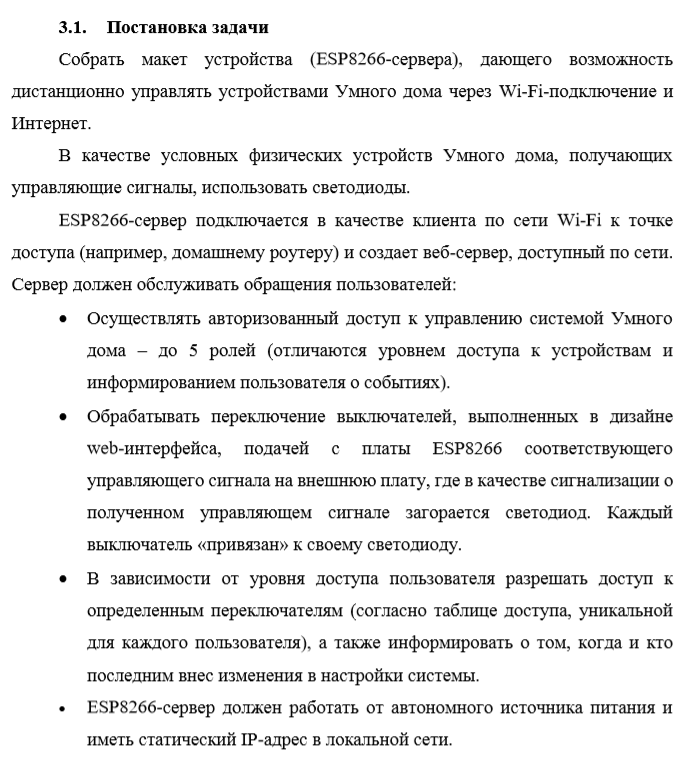

## Курсовая работа по предмету "Компьютерные сети". 2021.
<h2>"СИСТЕМА УПРАВЛЕНИЯ УМНЫМ ДОМОМ ПО WI-FI  С ПОМОЩЬЮ ESP8266"</h2>
Author: Ivan Mazlov

<h2>Краткий обзор</h2>
<ul>
<li>Релизован механизм дистанционного управления условными электроприборами (физические устройства):</li>
  <ul>
    <li>ESP8266 - основа устройства;</li>
    <li>Возможность подключения к серверу по локальной сети (или через NAT);</li>
    <li>Использование 74hc595 индикации подключенных пользователей (5 светодиодов) и статуса устройства (3 светодиода);</li>
  </ul>
<li>Система аутентификации пользователей (c++):
  <ul>
    <li>Уникальные логины и мультилогины;</li>
    <li>Уровень доступа пользователя определяется login:password и позволяет:
      <ul>
        <li>видеть статус устройста;</li>
        <li>управлять выключателем устройства;</li>
        <li>получать полную или частичную сводку;</li>
      </ul>
    </li>
    <li>Индикация светодиодом о нахождении пользователя с определенным login на сервере;</li>    
    <li>Использование html\css и Javascript на стороне пользователя;</li>
    <li>Отключение пользователей от сервера в случае длительной неактивности;</li>
  </ul>
</li>
</ul>

<h2>Техническое задание</h2>

 

<h2>Реализация</h2>

 Общая схема подключения светодиодов через 74ch595
 

 
 

 
 

 Общий вид программно-аппартной реализации курсового проекта
 

<h2>Итоги</h2>
Работа защищена на "отлично" (95 баллов).
