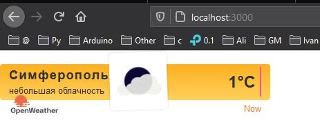
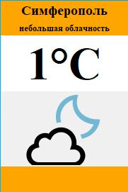
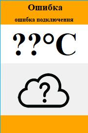

## Программирование
​Автор: Мазлов Иван
​ <h3> Первый семестр </h3>

МИНИСТЕРСТВО НАУКИ  И ВЫСШЕГО ОБРАЗОВАНИЯ РОССИЙСКОЙ ФЕДЕРАЦИИ 
Федеральное государственное автономное образовательное учреждение высшего образования 
"КРЫМСКИЙ ФЕДЕРАЛЬНЫЙ УНИВЕРСИТЕТ им. В. И. ВЕРНАДСКОГО" 
ФИЗИКО-ТЕХНИЧЕСКИЙ ИНСТИТУТ 
Кафедра компьютерной инженерии и моделирования

 
<h3 align="center">Отчёт по лабораторной работе № 1  по дисциплине "Программирование"</h3>
  

студента 1 курса группы ИВТ-б-о-201(2) 
Мазлова Ивана Денисовича 
направления подготовки 09.03.01 "Информатика и вычислительная техника"

  
<table>
<tr><td>Научный руководитель  старший преподаватель кафедры  компьютерной инженерии и моделирования</td>
<td>(&nbsp;&nbsp;&nbsp;&nbsp;&nbsp;&nbsp;&nbsp;&nbsp;&nbsp;&nbsp;&nbsp;&nbsp;&nbsp;&nbsp;&nbsp;&nbsp;)</td>
<td>Чабанов В.В.</td>
</tr>
</table>
  

 Симферополь, 2020

   
<h2>Цель работы</h2>

&nbsp;&nbsp;&nbsp;&nbsp;Разработать сервис предоставляющий данные о погоде в городе Симферополе на момент запроса.   В качестве источника данных о погоде используйте: http://openweathermap.org/. В состав сервиса входит: серверное приложение на языке С++ и клиентское приложение на языке Python.

<h2>Ход работы</h2>
<h3> 0. Введение. Структура http-запроса</h3>

&nbsp;&nbsp;&nbsp;&nbsp;Я изучил структуру http-запроса и понял назначение разных частей html-запроса, таких, как:  протокол, хост, порт, путь к ресурсу, строка с аргументами и якорь.

<h3>I. Подготовка к работе с сервисом openweathermap.org</h3>

&nbsp;&nbsp;&nbsp;&nbsp;Для начала работы с сервисом необходимо пройти регистрацию и получить уникальный API Key. 
Чтобы его получить я зарегистрировался на сайте http://openweathermap.org/ и в разделе API Keys получил следующий ключ: <b>b412de423d3145ef2e2941fa464b6aa1.</b> 

&nbsp;&nbsp;&nbsp;&nbsp;Я изучил пример использования API key http://openweathermap.org/appid#use, составил и протестировал запрос в браузере с использованием своего API Key, получил и изучил текст в формате JSON. 

&nbsp;&nbsp;&nbsp;&nbsp;Кроме того я ознакомился с дополнительными настройками сервиса(openweathermap.org/api/one-call-api#other), которые передаются в строке параметров (аргументов). 
Для работы нужно будет использовать следующие параметры: 
<ul>
<li>&lang=ru - получение запроса подписей данных на русском языке</li>
<li>&units=metric - в привычных нам метрических единицах (температура в градусах C)</li>
<li>&id=693805 - id города Симферополь (для первого запроса)</li>
<li>&exclude=current,minutely,daily,alerts - уменьшает объем передаваемых данных от сервера погода за счёт исключения из отчёта не нужной информации, такой как:
<ul>
<li>погода на текущую секунду</li>
<li>поминутный прогноз</li>
<li>детальный прогноз на весь день</li>
<li>различные информационные посылы сервера</li>
</ul>
</li></ul>
Все они перечисляются через запятую без пробелов.

Сервер /data/2.5/forecast не предоставляет почасовую информацию о погоде, но зато можно по /data/2.5/forecast?id=693805 , где 693805 - является id города Симферополя получить данные о широте и долготе Симферополя. Эти данные мы можем использовать для формирования почасового отчета по другому пути ресурса "/data/2.5/onecall?lat=44.9572&lon=34.1108, де lat и lon - долгота и широта для Симферополя.
 Полный первый запрос: http://api.openweathermap.org/data/2.5/forecast?id=693805&appid=b412de423d3145ef2e2941fa464b6aa1
 Полный второй запрос к серверу погоды с получением почасовых данных по Симферополю:  http://api.openweathermap.org/data/2.5/onecall?lat=44.9572&lon=34.1108&lang=ru&units=metric&exclude=current,minutely,daily,alerts&appid=b412de423d3145ef2e2941fa464b6aa1

<h3>II. Подготовка к работе с сервисом worldtimeapi.org</h3>

Сервер времени не требует регистрации и информация от него приходит в формате JSON.
Полный текст запроса к серверу времени: http://worldtimeapi.org/api/timezone/Europe/Simferopol
 Из всех данных, присылаемых сервером, нам необходимо только одно поле: ["unixtime"] - текущее время в unix-формате.
Точно такие же подписи времени присутствуют и во всех словарях в почасовом прогнозе погоды.
<h3>III. Подготовка серверного приложения</h3>
Далее я установил все необходимые для проекта библиотеки: httplib.h, json.hpp и requests(заодно и для Python) и приступил к написанию программного кода. За основу были взяты фрагменты кода, предоставленные в методичке.

Я не стал долго экспериментировать с запросами (т.к. тема для меня была более менее понятная) и сразу приступил к реализации серверной части. 

<ul>Серверная часть представляет из себя несколько подпрограмм: 
<li>main (тут осуществляется запуск сервера и перехват Get-запросов</li>
<li>Отдельно есть функция запроса к серверу с передачей её аргументов, к какому именно серверу нужно усуществить запрос: погодному или времени</li>
<li>Функция получения и обработки погодных данных, функция обработки данных сервера времени, поисковая функция в кэше данных погоды, функция, формрующая ответ на запрос "/" и
<li>Функция ответа на запрос "/raw" клиентского приложения</li></ul>

<ul>Также я добавил три обработчика Get-запросов:
<li>"/time"-выдает полные результаты последнего успешного обращения к серверу времени в виде json,</li> <li>"/stop"-удаленное завершение работы сервера и</li>
<li>"/full"-выдает весь кэш (без повторного обращения к серверу) погоды из памяти сервера в виде того же json.</li></ul>

&nbsp;&nbsp;&nbsp;&nbsp;Алгоритм поиска данных в кэше был оптимизирован. Вместо долгого метода перебора использован метод расчета нужного индекса.

&nbsp;&nbsp;&nbsp;&nbsp;Кроме того была разработана дополнительная система передачи ошибок в виде json-формата. Сейчас это ещё не реализовано, но можно передавать эти данные клиенту ({"w_srv_code": int, "t_srv_code":int, "g_err_code":int, "unixtime":int} для более информативного баннера.

&nbsp;&nbsp;&nbsp;&nbsp;Наиболее сложным мне показалось создание виджета, т.к. пришлось изучить большой кусок с++: работа с текстовыми данными типа string, и разницу между string и char.
Но всё заработало! Код получился весьма неоптимизированный, но я до этого практически не сталкивался с с++.  Привожу полный код клиентского приложения:

Рис 1. Виджет отдаваемый сервером

<code>
`
#define DEBUG_ON
#include <iostream>
#include "cpp_httplib/httplib.h"
#include "nlohmann/json.hpp"
//#include <stdio.h>  // Для printf
#include <fstream>
#include <stdio.h>
#include <locale>
#include <string>  //std::string s = std::to_string(some_int);

char w_ip[] = "http://api.openweathermap.org";  //"/data/2.5/forecast?id=693805";
const std::string w_dir = "/data/2.5/onecall?lat=44.9572&lon=34.1108";
const std::string w_opt = "&lang=ru&units=metric&exclude=current,minutely,daily,alerts";
const std::string w_key = "&appid=b412de423d3145ef2e2941fa464b6aa1";

char t_ip[] = "http://worldtimeapi.org";
const std::string t_dir = "/api/timezone/Europe/Simferopol";

std::string wiget_file_name = R"(.\include\iframe.html)";
std::string wiget_temp = "{hourly[i].temp}";
std::string wiget_icon = "{hourly[i].weather[0].icon}";
std::string wiget_description = "{hourly[i].weather[0].description}";

const std::string err_Tsrv = "Ошибка! Текущее время недоступно!";  // Ошибка сервера времени
const std::string err_Wsrv = "Ошибка! Данные погоды недоступны!";  // Ошибка сервера погоды
const std::string err_Gen  = "Ошибка! Данные не найдены!";         // Ошибка повторного поиска

using json = nlohmann::json;
using namespace httplib;   //std::string buffer("Hello, World!");

json w_json_data; json t_json_data;
json w_json_short; // = json::object();

int SiteAccess(std::string dir, char ip[], std::string ident, json& result) {
    #ifdef DEBUG_ON
    std::cout << "  + запрос " + ident + "\n";
    #endif
    Client weather_server(ip); auto res = weather_server.Get(dir.c_str());

    if (res) {
        #ifdef DEBUG_ON
        std::cout << "   > Статус запроса " << ident << ": " << res->status << std::endl;
        #endif
        if (res->status == 200) {
            result = json::parse(res->body);
            return (int)res->status;
        }
        else { return (int)res->status; }
    }
    else {
        auto err = res.error();
        #ifdef DEBUG_ON
        std::cout << "   > Код ошибки " << ident << ": " << err << std::endl;
        #endif
        return (int)err;
    }
}

int GetJsonTime(){
    return (t_json_data.is_null()) ? 0 : t_json_data["unixtime"].get<int>();
    //if (t_json_data.is_null()) return 0;
    //return t_json_data["unixtime"].get<int>();
}

int FindTimeInCash(int cur_time) {
    if (w_json_data.is_null()) return 0;
    int max_idx  = w_json_data["hourly"].size()-1;
    int max_time = w_json_data["hourly"][max_idx]["dt"].get<int>();
    max_idx      = 1 + max_idx - (max_time - cur_time) / 3600; // idx
    return (cur_time> max_time || max_idx<0)? 0 : max_idx;
}

std::string PrepareWiget() {

    std::ifstream inFile(wiget_file_name); // Файловая переменная
    std::string one_line;
    if (inFile.is_open()) {
        std::getline(inFile, one_line);
        getline(inFile, one_line, '\0');
        inFile.close();
        //std::cout << one_line << "\n";
    }
    else {
        std::cout << "Ошибка открытия файла: " << wiget_file_name << "\n"; return one_line;
    }

    std::size_t found = one_line.find(wiget_temp);
    if (found != std::string::npos)
    {
        one_line.replace(found, wiget_temp.size(), std::to_string(w_json_short["Reply"]["temp"].get<int>()));
    }

    found = one_line.find(wiget_icon);
    if (found != std::string::npos)
    {
        one_line.replace(found, wiget_icon.size(), w_json_short["Reply"]["icon"].get<std::string>());
    }

    found = one_line.find(wiget_description);
    if (found != std::string::npos)
    {
        one_line.replace(found, wiget_description.size(), w_json_short["Reply"]["description"].get<std::string>());
    }

    //std::cout << one_line << "\n";

    return one_line;
}

bool gen_response_common() {
    std::cout << "  + gen_common\n";

    w_json_short = json::object();

    int t_res = SiteAccess(t_dir, t_ip, "времени", t_json_data);
    w_json_short.push_back({ "t_srv_code", t_res});
    if (t_res != 200) {
        w_json_short.push_back({ "unixtime", 0 }); w_json_short.push_back({ "w_srv_code", -1 });
        std::cout << w_json_short.dump(4) << "\n"; return false; }
    
    w_json_short.push_back({ "unixtime", GetJsonTime() });

    int idx = FindTimeInCash(GetJsonTime());
    if (!idx) { // время не найдено. или погодосервер спит или устарел кэш пробуем ещё раз забрать погоду
        int w_res = SiteAccess(w_dir + w_opt + w_key, w_ip, "погоды", w_json_data);
        w_json_short.push_back({ "w_srv_code", w_res });

        if (w_res != 200) { // сервер погоды не ответил. выходим.
            std::cout << w_json_short.dump(4) << "\n"; return false; }

        idx = FindTimeInCash(GetJsonTime());
        if (!idx) { // не нашло время после обновления! просто выходим...
            w_json_short.push_back({ "g_err_code", -1 });
            std::cout << w_json_short.dump(4) << "\n"; return false; }
    }
    w_json_short.push_back({ "Reply", w_json_data["hourly"][idx - 1]["weather"][0] });
    w_json_short["Reply"].push_back({ "temp"     , w_json_data["hourly"][idx - 1]["temp"].get<float>() });
    return true;
}

void gen_response_root(const Request& req, Response& res) {
#ifdef DEBUG_ON 
    std::cout << "  + gen_root\n";
#endif
    // отдаем виджет
    if (gen_response_common()) { 
        res.set_content(PrepareWiget(), "text/html");
    }//Error 
    else { res.set_content(w_json_short.dump(4) + "\n", "text/html"); }

    return;
}

void gen_response_raw(const Request& req, Response& res) {
#ifdef DEBUG_ON 
    std::cout << "  + gen_raw\n";
#endif
    if (gen_response_common()) {
        res.set_content(w_json_short["Reply"].dump(4) + "\n", "text/plain");
    }
    else { res.set_content(w_json_short.dump(4) + "\n", "text/plain"); }
}

void gen_response_full(const Request& req, Response& res) {
#ifdef DEBUG_ON 
    std::cout << "     + gen_full\n";
#endif
    if (gen_response_common()) {
        res.set_content(w_json_data.dump(4) + "\n", "text/plain");
    }
    else { res.set_content(w_json_short.dump(4) + "\n", "text/plain"); }
}

void gen_response_time(const Request& req, Response& res) {
    #ifdef DEBUG_ON 
    std::cout << " + gen_time\n";
    #endif
    int t_res = SiteAccess(t_dir, t_ip, "времени", t_json_data);
    if (t_res == 200) res.set_content(t_json_data.dump(4) + "\n", "text/plain");
    else res.set_content(w_json_short.dump(4), "text/plain");
}

int main() {
    setlocale(LC_ALL, "Russian");
    Server svr;
    svr.Get("/", gen_response_root);
    svr.Get("/raw", gen_response_raw);
    svr.Get("/full", gen_response_full);
    svr.Get("/time", gen_response_time);
    svr.Get("/stop", [&](const Request& req, Response& res) {
        std::cout << "Сервер остановлен по запросу пользователя\n";
        res.set_content("Сервер остановлен по запросу пользователя\n", "text/plain");
        svr.stop(); });
    //svr.Get("/refresh"  , [&](const Request& req, Response& res) { // повторный принудительный запрос к серверу погоды
    //    if (!GetWeather()) { std::cout << err_Wsrv + " Сервер остановлен\n";
    //    res.set_content(err_Wsrv+"Сервер остановлен\n", "text/plain");
    //    svr.stop(); } 
    //    res.set_content("Данные погоды загружены заново\n", "text/plain");
    //    });

    std::cout << "Сервер погоды запущен.\n";

    svr.listen("localhost", 3000); // supports  http://localhost:1234/
    return 0;
}
`
</code>

<h3>IV. Подготовка клиентского приложения</h3>

&nbsp;&nbsp;&nbsp;&nbsp;С клиентским приложением не возникло никаких сложностей, если не считать того, что я никогда ничего не делал на tkinter. Лучше использовать для этих целей, наверное, Kivy.
Весь функционал и алгоритм работы Клиента был выполнен.

&nbsp;&nbsp;&nbsp;&nbsp;Дополнительно я добавил получение Клиентом от Сервера названия иконки погоды, скачал все иконки и добавил выведение на баннер дополнительно ещё и соответствующей погоде иконки. Как дополнительное отличие, в ходе изучения tkinter я наткнулся на функцию .update_idletasks(), которая позволяет проводить обновление цвета надписей. Поэтому я добавил ещё изменение цвета "description" во время ожидания обновления на красный.

&nbsp;&nbsp;&nbsp;&nbsp;Обращаю Ваше внимание, что для корректной работы Клиента необходимо будет ещё загрузить папку с иконками icons_for_python_client. Она должна находиться в той же папке, что и сам Клиент. Если её не будет приложение сможет работать, но не будет отображать иконок.

<table>
<tr>
<td>

</td>
<td>

</td></tr>
<tr><td>Рис.2 Баннер Клиента после получения данных</td>
<td>Рис.3 Баннер Клиента после неудачного получения информации</td></tr>
</table>

&nbsp;&nbsp;&nbsp;&nbsp;Привожу ниже полный текст Клиентского приложения:

<code>
`
import requests
import json
from tkinter import *

def GetNewData(r):
    err = False
    data = {'Town':' Ошибка', 'Desc': 'ошибка подключения', 'Temp':"??°C", 'Icon':'unknown'}
    try:
        desc.config(fg = "red")
        root.update_idletasks()
        result = requests.get('http://localhost:3000/raw')
    except:
        desc.config(fg = "black")
        root.update_idletasks()
        print('Ошибка получения данных.')
        err = True
    else:
        desc.config(fg = "black")
        root.update_idletasks()
        if result.status_code!=200:
            print('Код операции: ', result.status_code)
            data['Desc']='Ошибка' + str(req.status_code)
            err = True
        else:
            ret = result.json()
            print(ret)
            if "temp" not in ret: err = True
    if not err:
        UpdateWidget( { 'Town':'Симферополь', 'Temp':str(int(ret["temp"])) + "°C",
                        'Desc': ret["description"].encode('l1').decode(),'Icon':ret["icon"]})
    else: UpdateWidget(data)

def UpdateWidget(data):
    town["text"] = data['Town']
    desc["text"] = data['Desc']
    temp["text"] = data['Temp']

    canvas.delete("all")
    try:
        my_img = PhotoImage(file = ".\\icons_for_python_client\\" + data['Icon'] + ".png")
        canvas.create_image(0, -10, anchor = 'nw', image = my_img)
        canvas.image = my_img
    except:
        print('Файл с иконками не найден. Нужно установить в папку icons_for_python_client')

root = Tk()
root.geometry("180x270+300+400")
root.resizable(0, 0)
root.overrideredirect(1)

town   = Label(root, height=1, width=20, fg='black', bg='orange', font=("Times", 14, 'bold'))
desc   = Label(root, height=1, width=30, fg='black', bg='orange', font=("Times",  9, 'bold'))
temp   = Label(root, height=1, width=10, fg='black', bg='white' , font=("Times", 48, 'bold'))
footer = Label(root, height=2, width=30, bg="orange")
canvas = Canvas(height = 150, width = 130)

town.pack(  side=TOP)
desc.pack(  side=TOP)
temp.pack(  side=TOP)
footer.pack(side=BOTTOM)
canvas.pack(side=BOTTOM)

GetNewData(None)
root.bind("<Button-1>", GetNewData)
mainloop()
`
</code>

<h3>V. Туннель</h3>

&nbsp;&nbsp;&nbsp;&nbsp;Я изучил программу ngrok (https://ngrok.com/) и научился создавать тунели для localhost. Такие знания могут пригодиться в дальнейшем для работы с клиентами.

<h2>Вывод</h2>

&nbsp;&nbsp;&nbsp;&nbsp;В целом работа мне очень понравилась. В ходе работы пришлось изучить много нового и интересного. Познакомиться с новыми технологиями. Большое спасибо!

