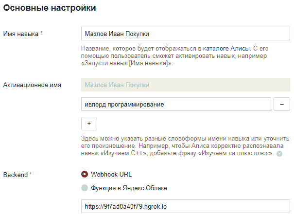
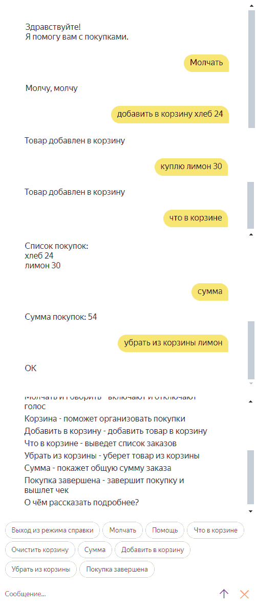
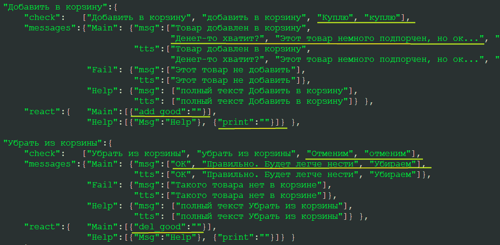
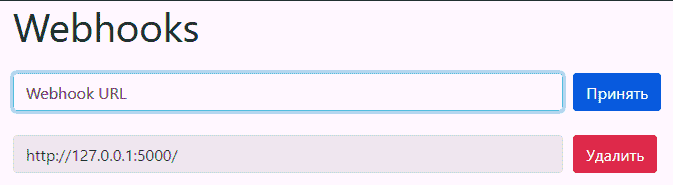
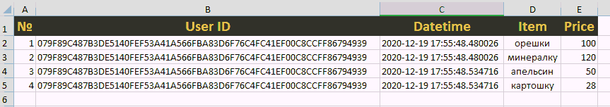

## Программирование
​Автор: Мазлов Иван
​<br><h3> Первый семестр </h3>
<p align="center">МИНИСТЕРСТВО НАУКИ  И ВЫСШЕГО ОБРАЗОВАНИЯ РОССИЙСКОЙ ФЕДЕРАЦИИ<br>
Федеральное государственное автономное образовательное учреждение высшего образования<br>
"КРЫМСКИЙ ФЕДЕРАЛЬНЫЙ УНИВЕРСИТЕТ им. В. И. ВЕРНАДСКОГО"<br>
ФИЗИКО-ТЕХНИЧЕСКИЙ ИНСТИТУТ<br>
Кафедра компьютерной инженерии и моделирования</p>
<br>
<h3 align="center">Отчёт по лабораторной работе № 2<br> по дисциплине "Программирование"</h3>
<br><br>
<p>студента 1 курса группы ИВТ-б-о-201(2)<br>
Мазлова Ивана Денисовича<br>
направления подготовки 09.03.01 "Информатика и вычислительная техника"</p>
<br><br>
<table>
<tr><td>Научный руководитель<br> старший преподаватель кафедры<br> компьютерной инженерии и моделирования</td>
<td>(&nbsp;&nbsp;&nbsp;&nbsp;&nbsp;&nbsp;&nbsp;&nbsp;&nbsp;&nbsp;&nbsp;&nbsp;&nbsp;&nbsp;&nbsp;&nbsp;&nbsp;&nbsp;&nbsp;&nbsp;&nbsp;&nbsp;&nbsp;&nbsp;&nbsp;&nbsp;&nbsp;&nbsp;&nbsp;&nbsp;&nbsp;&nbsp;)</td>
<td>Чабанов В.В.</td>
</tr>
</table>
<br><br>
<p align="center" > Симферополь, 2020</p>
<hr>


<h1>Лабораторная работа №2 Алиса</h1>
   
<h2>Цель работы:</h2>
<ul>
<li>Получить представления о структуре post-запроса;</li>
<li>Изучить webhooks как метод взаимодействия web-приложений;</li>
</ul>

<h2>Постановка задачи</h2>

<ul>
<li>Разработайте и зарегистрируйте навык для Алисы на сервисе ЯндексюДиалоги;</li>
<li>В качестве backend-a для навыка реализуйте приложение на языке С++ выполняющее следующие функции:</li>
<ul>
<li>Составление продуктовой корзины:</li>
<ul>
<li>Добавление продукта в корзину;</li>
<li>Удаление продукта из корзины;</li>
<li>Очистка корзины;</li>
<li>Вывод списка товаров в корзине;</li>
<li>Подсчёт стоимости товаров в корзине.</li>
</ul>
<li>Вывод справочной информации по навыку;</li>
<li>Регистрацию webhook-ов сторонних сервисов;</li>
<li>Отправку данных на сторонние сервисы. </li>
</ul>
<li>В качестве стороннего сервиса реализуйте приложение на языке Python выполняющее следующие функции:</li>
<ul>
<li>Ожидание данных о покупке;</li>
<li>Сохранение поступивших данных в excel-документ.</li>
</ul>
</ul>
Подробности указаны далее.

<p>&nbsp;&nbsp;&nbsp;&nbsp;</p><br>&nbsp;&nbsp;&nbsp;&nbsp;

<h2>Ход работы</h2>

<p>&nbsp;&nbsp;&nbsp;&nbsp;Я зарегистрировал на ресурсе Яндекс.Диалоги новый диалог и назвал его "Мазлов Иван Покупки". Также провел все необходимые настройки, подключил к нему тунель ngrok и нарисовал иконку.</p>
<p align="center"></p>
<p align="center">Рис 1. Настройка диалога.</p>

<p>&nbsp;&nbsp;&nbsp;&nbsp;Я изучил как работает Webhook и как с помощью него можно взаимодействовать с Яндекс-Алисой. В приложении можно найти детальный список ответов от сервиса и список всех необходимых для работы с ним полей.
После началась самая сложная часть: я написал программный код на с++ для работы с сервисом.</p>
<p align="center"></p>
<p align="center">Рис 2. Демонстрация работы кода.</p>

<p>&nbsp;&nbsp;&nbsp;&nbsp;Надо сказать, что я пошел по более сложному пути и "вынес" всю структуру диалога за пределы кода в json файл - Dialog.json. Этот файл легко можно редактировать в обычном редакторе и потом только нужно перезапустить сервер. Такой подход позволил добавить дополнительный функционал как, например, возможность выбора случайного ответа из списка, лёгкое расширение количества поддерживаемых Алисой команд, можно без особого труда отредактировать любые тексты на кнопках и структуру кнопок на каждой странице, добавить больше двух изначальных (Покупка и Помошь) страниц. К сожалению из-за лимита времени придумать и реализовать ещё каки-то функционалы не удалось. Но и то, что есть может быть использовано намного более гибко.</p>

<p align="center"></p>
<p align="center">Рис 3. Редактирование файла Dialog.json.</p>

<p>&nbsp;&nbsp;&nbsp;&nbsp;Серверный код обслуживает также добавление webhook-ов через post-запросы.</p>

<p align="center"></p>
<p align="center">Рис 4. Редактирование webhook-ов.</p>

<p>&nbsp;&nbsp;&nbsp;&nbsp;В разработке сервера на пайтоне мне понравилось, что пришлось изучить работу с библиотеками openpyxl и Falsk.
Я немного поэксперементировал с оформлением листа, но времени было не очень много, чтобы разобраться подробней.
Я дополнительно реализовал функционал строгого контроля data.xlsx файла: чтобы он создавал лист, правильно переименовывал, удалял ненужные листы и обрабатывал все ошибки при открытии и записи файла.</p>

<p align="center"></p>
<p align="center">Рис 5. Внешний вид таблички заказов.</p>

<p>&nbsp;&nbsp;&nbsp;&nbsp;Привожу ниже полный текст серверного приложения (с++):</p>


```c++

#include <iostream> //#include <cmath> //#include <iomanip>
#include <cpp_httplib/httplib.h>
#include <nlohmann/json.hpp>
#include <vector>
#include <string>
#include <iostream>
#include <fstream>
using namespace std;
using namespace httplib;
using json = nlohmann::json;

string Dialog_filename      = "Dialog.json";
string WHConfig_filename    = "Webhooks_Cfg.json";
string WHT_html_filename    = "webhooks_template.html";
string WH_pattern           = "{webhooks_list}";

string del1 = u8R"(<div class = "form-row align-items-center"><div class = "col"><input type = "text" value = ")";
string del2 = u8R"(" class = "form-control mb-2" disabled></div><div class = "col"><button type = "submit" name = "del" value = ")";
string del3 = u8R"(" class = "btn btn-danger mb-2">Удалить</button></div></div>)";

json j_shablon_btn = json::parse(u8R"({ "title": " ", "hide" : true })"); //"payload": {},
json j_shablon_rep = json::parse(u8R"({ "response": { "text": " ", "tts": " ", "buttons": [],
                                        "end_session": false }, "version": "1.0"})");
// "silent_mode"    - 0- Ализа заткнулась,  1 - продолжает говорить 
// "screen":"Main"  - текущий экран
json ses_shablon = json::parse(u8R"({"screen":"Main", "silent_mode":1, "rnd_on": true ,
                                     "session_id":"", "basket": { "user_id": "", "check" : [] } } )");
json good = json::parse(u8R"({ "item": "", "price" : 0 })");
//json basket = json::parse(u8R"({ "user_id": "", "check" : [] })");

bool Send_to_webhooks = false;
json cfg, ses; // config file and session json
json button_exception = {}, s = {}, a = {}; // short names for dialog parts: button_exception, screens, actions

void ppp(json& data, bool yy=true){
    ofstream logger("log.txt");
    logger << data.dump(1) << "\n==================================================================\n\n\n";
    if (yy) logger.close();
    }
void pps(string& data, bool yy = true) {
    ofstream logger("log.txt");
    logger << data << "\n==================================================================\n\n\n";
    if (yy) logger.close();
}

bool exists(const json& j, const string& key){ // проверка, есть ли ключ в словаре
    return j.find(key) != j.end();}

void MakeBtns(json& list_for_buttons, json& need_button_list) {
    for (unsigned i = 0; i < need_button_list.size(); i++){
        string new_button_name = need_button_list[i];

        if (exists(button_exception, new_button_name)) {
            if (button_exception[new_button_name]["silent_mode"] == ses["silent_mode"]) continue;
        }
        json new_button = j_shablon_btn;
        new_button["title"] = new_button_name;
        list_for_buttons.push_back(new_button);
    }
}

json MakeReply(string txt, string tts, bool end_session=false) {
    json reply = j_shablon_rep;
    string tmp = ses["screen"];
    if (!exists(s, ses["screen"])) ses["screen"] = "Main";

    MakeBtns(reply["response"]["buttons"], s[tmp]["buttons"]);
    
    if (ses["silent_mode"] == 0) tts="sil <[500]>";
    reply["response"]["text"]        = txt;
    reply["response"]["tts"]         = tts;
    reply["response"]["end_session"] = end_session;
    //ppp(reply);
    return reply;
}

bool In_str(string main_string, string sub_string) {
    // возвращает true, если подстрока найдена в строке
    return (main_string.find(sub_string) != std::string::npos)? true:false;
}

int CntToken(string data) {
    int cnt = 1;                                 // points to the next token
    while (data.find(" ") != std::string::npos) {
        cnt += 1;
        data.replace(data.find(" "), size(" "), "");
    }
    return cnt;
}

bool SendWebhooks(json& basket, string site) {

    string url = site.substr(0, site.find("/", 9));  // url // https:\\ 9+ chars
    string dir = site.substr(site.find("/", 9));                     // dir

    cout << "   > url: " << url.c_str() << " dir: " << dir.c_str() << " ... ";

    Client cli(url.c_str());
    auto cli_res = cli.Post(dir.c_str(), basket.dump(), "application/json");

    if (cli_res) { // Проверяем статус ответа, т.к. может быть 404 и другие  //std::cout << cli_res->body << std::endl;
        if (cli_res->status == 200) { cout << " ok\n";   // В res->body лежит string с ответом сервера
            return true;
        }
        else  std::cout << "Status code: " << cli_res->status << std::endl;
    }
    else { auto err = cli_res.error();  std::cout << "Error code: " << err << std::endl; }
    return false;
}


// rand() % elements_in_vect     "rnd_on"
json OrderProcess(json& body){
    srand(time(NULL));

    string msg_picker = "";                   // ключ правильного сообщения
    int msg_idx = 0;
// Инициализация новой сессии с приветственным ответом. +обнуление корзины.
    if (body["session"]["new"].get<bool>()) { // true-для новой сесии, false- продолжение
        ses = ses_shablon;
        ses["session_id"] = body["session"]["session_id"];            // сохраняем новый id сессии
        
        if (empty(body["session"]["user"]["user_id"])) ses["basket"]["user_id"] = "anonymous";
        else ses["basket"]["user_id"] = body["session"]["user"]["user_id"];       // и id пользователя или "anonymous"

        cout << " > new session:" << ses["session_id"]        << "\n";
        cout << " > user_id:"     << ses["basket"]["user_id"] << "\n";
            
        msg_picker = ses["screen"];
        return MakeReply(s[msg_picker]["in_msg"][0], s[msg_picker]["in_tts"][0]);
    }
    else if (body["session"]["session_id"] != ses["session_id"])    // пришла сессия без id?
      // сессия поменяла свой id неожиданно?
    { // резко завершаем разговор и валим закрываем сессию=true
      msg_picker = ses["screen"];
       return MakeReply(s["Main"]["out_msg"][0], s["Main"]["out_tts"][0], true);
    }

    string msg_out = "", tts_out = "";
    string fnd_word="", fnd_act="";  // для совпавшей action и конкретно совпавшего слова
    
    string current_screen = ses["screen"];
    //for (auto& action : s[current_screen]["actions"]) { // идём по списку возможных реакций на текущем screen

    json sa = s[current_screen]["actions"];
    for (unsigned i=0; i< sa.size();i++){ // список экшинов на экране
        string new_chck = sa[i]; // конкретный экшин

        if (!exists(a, new_chck)) continue;              // такой реакции нет в списке реакций. пропускаем.
        for (unsigned j = 0; j < a[new_chck]["check"].size(); j++) { // идём оп словам контрольным

            if (!In_str(body["request"]["original_utterance"], a[new_chck]["check"][j])) continue;// нет совпадения - дальше
            fnd_act = new_chck;                         // запоминаем "сработавший" action
            fnd_word = a[new_chck]["check"][j];         // и конкретное слово, на котором сработало
            break;
        } if (fnd_act!="") break;
    }

    if (empty(fnd_act)) { // никаких признаков правильного ввода от пользователя, возвращаем "я не знаю такой команды" // доделать
        return MakeReply(s[(string)ses["screen"]]["fail_msg"][0], s[(string)ses["screen"]]["fail_tts"][0]);
    }

    //// command processing section
    for (auto &com : a[fnd_act]["react"][(string)ses["screen"]]) { // com= [{"CgangeVar":"Can_talk", "Val":false}, {"Msg":"Start"}]
        if (exists(com, "Msg")) {              // обработка команд Msg: устанавливаем текст ответа
            msg_picker = com["Msg"];           // берём название текста, для печати из значения команды "Msg"
            //if (ses["rnd_on"]) { msg_idx = rand() % s[msg_picker]["in_msg"].size(); } else { msg_idx = 0; }
            msg_out = msg_out + a[fnd_act]["messages"][msg_picker]["msg"][msg_idx].get<string>();
            tts_out = tts_out + a[fnd_act]["messages"][msg_picker]["tts"][msg_idx].get<string>();
            continue;
        }
        else if (exists(com, "ChangeVar_Can_talk")) {
            ses["silent_mode"] = com["ChangeVar_Can_talk"].get<int>();
        }
        else if (exists(com, "ChangeVar_screen")) {
            ses["screen"] = com["ChangeVar_screen"].get<string>();
        }
        else if (exists(com, "print")) { } // так и надо
        else if (exists(com, "del_good"))   { //"del_good""add_good""sum""dell_all""list"
            string new_good = body["request"]["nlu"]["tokens"][CntToken(fnd_word)];
            bool fnd_good = false;
            for (unsigned i = 0; i < ses["basket"]["check"].size(); i++) {
                if (ses["basket"]["check"][i]["item"] != new_good) continue;
                ses["basket"]["check"].erase(i);
                fnd_good = true;
                break;
            }
            msg_picker = "Fail";
            if (fnd_good) msg_picker = "Main";
            msg_out = msg_out + a[fnd_act]["messages"][msg_picker]["msg"][0].get<string>();
            tts_out = tts_out + a[fnd_act]["messages"][msg_picker]["tts"][0].get<string>();
            }
        else if (exists(com, "list"))          { // List of goods

            int cnt = 0;
            bool first_run = true;
            for (unsigned i = 0; i < ses["basket"]["check"].size(); i++) {
                if (first_run) {
                    msg_out += string(a[fnd_act]["messages"]["Main"]["msg"][0]);
                    tts_out += string(a[fnd_act]["messages"]["Main"]["tts"][0]);
                    first_run = false;
                }
                string m1 = string(ses["basket"]["check"][i]["item"]); //.get<string>()
                string m2 = to_string(ses["basket"]["check"][i]["price"]);
                msg_out = msg_out + m1 + "\t" + m2 + "\n";
                tts_out = msg_out + m1 + "\t" + m2 + "\n";
                cnt += 1;
            }

            if (cnt == 0) { // если не найдено в корзине
                msg_out = msg_out + string(a[fnd_act]["messages"]["Fail"]["msg"][0]);
                tts_out = tts_out + string(a[fnd_act]["messages"]["Fail"]["tts"][0]);
            }
        }
        else if (exists(com, "sum"))       { // Sum
            int price = 0;
            for (unsigned i = 0; i < ses["basket"]["check"].size(); i++) {
                price = price + ses["basket"]["check"][i]["price"].get<int>();
            }

            if (price != 0) { // есть покупки
                msg_out = msg_out + a[fnd_act]["messages"]["Main"]["msg"][0].get<string>();
                tts_out = tts_out + a[fnd_act]["messages"]["Main"]["tts"][0].get<string>();
                msg_out = msg_out + to_string(price);
                tts_out = tts_out + to_string(price);
            }
            else {
                msg_out = msg_out + a[fnd_act]["messages"]["Fail"]["msg"][0].get<string>();
                tts_out = tts_out + a[fnd_act]["messages"]["Fail"]["tts"][0].get<string>();
            }
        }
        else if (exists(com, "add_good"))  {
            string new_good = body["request"]["nlu"]["tokens"][CntToken(fnd_word)];
            int price = 0;
            for (unsigned i = 0; i < body["request"]["nlu"]["entities"].size(); i++) {
                if     (body["request"]["nlu"]["entities"][i]["type"] != "YANDEX.NUMBER") continue;
                price = body["request"]["nlu"]["entities"][i]["value"];
                break;
            }
            msg_picker = "Fail";
            if (price != 0) {
                msg_picker = "Main";
                good["item"]  = new_good;
                good["price"] = price;
                ses["basket"]["check"].push_back(good);
            }

            srand(time(NULL));
            if (ses["rnd_on"]) { msg_idx = rand() % a[fnd_act]["messages"][msg_picker]["msg"].size(); } else { msg_idx = 0; }
            cout << msg_idx << "/" << a[fnd_act]["messages"][msg_picker]["msg"].size() << " - " << ses["rnd_on"] << "\n";
            msg_out = msg_out + a[fnd_act]["messages"][msg_picker]["msg"][msg_idx].get<string>();
            tts_out = tts_out + a[fnd_act]["messages"][msg_picker]["tts"][msg_idx].get<string>();
        }
        else if (exists(com, "dell_all"))  {
            ses["basket"] = json::parse(u8R"({ "user_id": "", "check" : [] })");  // очистили корзину
            ses["basket"]["user_id"] = body["session"]["user"]["user_id"];        // запомнили id пользователя
        }
        else if (exists(com, "end session"))       { //"send webhooks" "end session"
            
            Send_to_webhooks = true;
            cout << "   #" << msg_out << "\n";
            return MakeReply(msg_out, tts_out, true);
        }
    }
    if (msg_out == "") { msg_out = u8"Что-то не так..."; }

    return MakeReply(msg_out, tts_out);
}

void gen_response(const Request& req, Response& res) {

    json body = json::parse(req.body.c_str()); //u8     //cout << req.body.c_str()<<"\n\n";
    
    json ttt = OrderProcess(body);

    res.set_content(ttt.dump(), "text/json; charset=UTF-8");
    
    if (Send_to_webhooks)
    {
        cout << "Session closed. Sending data to:\n";
        ppp(ses["basket"]);
        for (int i = 0; i < cfg["webhooks"].size(); i++) {
            string webhook_url = cfg["webhooks"][i];
            SendWebhooks(ses["basket"], webhook_url);
        }
        Send_to_webhooks = false;
    }
}

bool ConfigSave(json& cfg) {
    ofstream cfg_file(WHConfig_filename);
    if (!cfg_file.is_open()) {
        cout << "failed to save config.\n";    // some file create error
        return false; }
    cfg_file << cfg; cfg_file.close(); // {"webhooks":["site1.com","site2.com"]}
    cout << "done.\n";
    return true;
}

bool JsonRead(json& json_data, string filename = WHConfig_filename) {
    // Checks Webhooks_Cfg.json, reads it or creates empty one. 
    // Opens Dialog.json and reads it
    std::cout << "Opening file: "<< filename << " ... ";
    ifstream json_file(filename);
    if (!json_file.is_open()) {
        std::cout << "not found";
        if (filename == WHConfig_filename) { // no config -> create new -> fill empty
            std::cout << " ... creating new ... "; json_data = json::parse(R"({"webhooks": []})");
            json_file.close();
            return ConfigSave(json_data); }
        else {
            std::cout << "!!! Critical error !!! Server Stoped !!!";
            json_file.close();
            return false; }
    }
    
    std::cout << "reading ... ";
    try { json_file >> json_data; } // json: cfg or dialog: found and opened, try to json::parse it
    catch (json::parse_error& e) {
        std::cout << "\nError!" << e.what() << '\n';
        json_file.close();
        return false; }
    json_file.close(); std::cout << "done.\n";
    return true; // cout << cfg.dump(4);
}

void gen_response_WHGetPost(const Request& req, Response& res) {
    if (!JsonRead(cfg)) {
        res.set_content(u8"Какие-то проблемы с файлом конфига.", "text/html; charset=UTF-8");
        return; }

    if (req.method == "POST") {
        if (req.has_param("del")) {
            auto site_to_del = req.get_param_value("del");
            for (unsigned i = 0; i < cfg["webhooks"].size(); i++)
            {// cout << "   json(site_to_del)="<< json(site_to_del) << endl; cout << "   i = " << i << " " << cfg["webhooks"][i] << endl;
                if (cfg["webhooks"][i] == site_to_del){             //cout << "   del> i = " << i << " " << cfg["webhooks"][i] << endl;
                    cfg["webhooks"].erase(i); ConfigSave(cfg);
                    break;
                }
            }
        }

        if (req.has_param("set")) {
            auto val_set = req.get_param_value("set");
            cfg["webhooks"].push_back(val_set); ConfigSave(cfg); }
    }

    cout << cfg["webhooks"].size() << "\n" << cfg.dump(4) << endl;
       
    ifstream WH_html(WHT_html_filename);
    if (!WH_html.is_open()){
        cout << WHT_html_filename << " not found. Get request to /webhooks failed.\n"; return;}

    string WH_template_text; getline(WH_html, WH_template_text, '\0'); WH_html.close(); // сборка вставки в reply
    string reply_insert;

    for (unsigned i = 0; i < cfg["webhooks"].size(); i++) {
        reply_insert.append(del1).append(cfg["webhooks"][i]).append(del2).append(cfg["webhooks"][i]).append(del3);
    } //for (int i = 0; i < stro.length(); i++){if (stro[i] == '\\'){stro.erase(i);}}

    WH_template_text.replace(WH_template_text.find(WH_pattern), size(WH_pattern), reply_insert);
    res.set_content(WH_template_text, "text/html; charset=UTF-8");  // ответ на Get запрос
}

int main() {
    setlocale(LC_ALL, "Russian");
    json dialog;
    if (!JsonRead(dialog, Dialog_filename)) {
            cout << "\n\n>!!! Error !!! Dialog.json file was not detected or broken. Quit. !!!";
            return 0; }
    else {
        if (!dialog.contains("/dialog"_json_pointer)         ||
            !dialog.contains("/dialog/actions"_json_pointer) ||
            !dialog.contains("/dialog/screens"_json_pointer)) {
                cout << "\n\n>!!! Error !!! Dialog.json file was not detected or broken. Quit. !!!";
                return 0; }
            cout << "   > Dialog.json structure OK.\n";
        }

    s = dialog["dialog"]["screens"];  a = dialog["dialog"]["actions"];
    if (exists(dialog["dialog"], "button_exception")) button_exception = dialog["dialog"]["button_exception"];
    dialog.clear();
    JsonRead(cfg);

    Server svr;
    svr.Post("/", gen_response);
    svr.Get("/webhooks", gen_response_WHGetPost);
    svr.Post("/webhooks", gen_response_WHGetPost);
    std::cout << "Server started at: localhost:3000 ... OK\n";    
    svr.listen("localhost", 3000);
}
```

<p>&nbsp;&nbsp;&nbsp;&nbsp;Привожу ниже полный текст текщей версии Dialogs.json:</p>  
```json
{
 "version":"7.0",
 "DateTime":"17dec2020.4:15",
 "dialog":{
  "button_exception":{"Молчать":{"silent_mode":0}, "Говорить":{"silent_mode":1} },
    
  "screens":{
        "Main":{
            "in_msg": ["Здравствуйте!\n Я помогу вам с покупками."],
            "in_tts": ["Здравствуйте! Я помогу вам с покупками."],
            "out_msg":["Ой мне срочно отойти надо... зайдите ещё раз."],
            "out_tts":["Ой мне срочно отойти надо... зайдите ещё раз."],
          "fail_msg": ["Команда не опознана"],
          "fail_tts": ["Команда не опознана"],
            "buttons":["Молчать", "Говорить", "Помощь" ],
            "actions":["Молчать", "Говорить", "Помощь", "Что в корзине",
                       "Очистить корзину",    "Сумма", "Добавить в корзину",
                       "Убрать из корзины",   "Покупка завершена"] },
        "Help":{
            "in_msg":["-"],
            "in_tts":["-"],
          "fail_msg": ["Давайте лучше спросите что-то о назначении команд"],
          "fail_tts": ["Давайте лучше спросите что-то о назначении команд"],
            "buttons":["Выход из режима справки",
                       "Молчать", "Говорить", "Помощь", "Что в корзине", "Очистить корзину", 
                       "Сумма", "Добавить в корзину", "Убрать из корзины", "Покупка завершена"],
            "actions":["Выход из режима справки", 
                       "Молчать", "Говорить", "Помощь", "Что в корзине",
                       "Очистить корзину",    "Сумма", "Добавить в корзину",
                       "Убрать из корзины",   "Покупка завершена"] } },
            
    "actions":{
        "Покупка завершена":{
       	    "check":["Покупка завершена", "покупка завершена", "Закончим", "закончим"],
            "messages":{"Main": {"msg":["Заходите ещё", "Немного. Может, скоро заработаете и зайдёте ещё"],
                                 "tts":["Заходите ещё", "Немного. Может, скоро заработаете и зайдёте ещё"]},
                         "Help": {"msg": ["полный текст Покупка завершена"],
                                  "tts": ["полный текст Покупка завершена"]} },
             "react":{   "Main":  [{"Msg":"Main"}, {"end session":""}],
                         "Help"  :[{"Msg":"Help"}, {"print":""}]} },
                         
        "Молчать": {
          	"check":   ["Молчать", "молчать", "Заткнись", "заткнись"],
            "messages":{"Main": {"msg":["Молчу, молчу", "Замолкаю"],
                                 "tts":["Молчу, молчу", "Замолкаю"]},
                        "Help": {"msg": ["полный текст Молчать"],
                                 "tts": ["полный текст Молчать"]} },
            "react":{   "Main":[{"Msg":"Main"}, {"ChangeVar_Can_talk":false}],
                        "Help":[{"Msg":"Help"}, {"print":""}]} },

        "Говорить":{
            "check":   ["Говорить", "говорить", "Поговори", "поговори"],
            "messages":{"Main": {"msg":["Хорошо", "Поговорю с тобой"],
                                 "tts":["Хорошо", "Поговорю с тобой"]},
                         "Help": {"msg": ["полный текст Говорить"],
                                  "tts": ["полный текст Говорить"]} },
             "react":{   "Main":[{"Msg":"Main"}, {"ChangeVar_Can_talk":true}],
                         "Help":[{"Msg":"Help"}, {"print":""}]} },

        "Помощь":{
            "check":   ["Помощь", "помощь" ],
            "messages":{"Ok1":  {"msg":["Помощь поможет разобраться с командами\n\nМолчать и Говорить - включают и отключают голос\n\n"],
                                 "tts":["Помощь поможет разобраться с командами\n\nМолчать и Говорить - включают и отключают голос\n\n"]},
                        "Ok2":  {"msg":["Корзина - поможет организовать покупки\n\nДобавить в корзину - добавить товар в корзину\n\n"],
                                 "tts":["Корзина - поможет организовать покупки\n\nДобавить в корзину - добавить товар в корзину\n\n"]},
                        "Ok3":  {"msg":["Что в корзине - выведет список заказов\n\nУбрать из корзины - уберет товар из корзины\n\n"],
                                 "tts":["Что в корзине - выведет список заказов\n\nУбрать из корзины - уберет товар из корзины\n\n"]},
                        "Ok4":  {"msg":["Сумма - покажет общую сумму заказа\n\nПокупка завершена - завершит покупку и вышлет чек\n\n"],
                                 "tts":["Сумма - покажет общую сумму заказа\n\nПокупка завершена - завершит покупку и вышлет чек\n\n"]},
                        "Ok5":  {"msg":["О чём рассказать подробнее?"],
                                 "tts":["О чём рассказать подробнее?"]},
                        "Help": {"msg": ["полный текст Помощь"],
                                 "tts": ["полный текст Помощь"]} },
            "react":{   "Main":[{"Msg":"Ok1"}, {"Msg":"Ok2"}, {"Msg":"Ok3"},
                                {"Msg":"Ok4"}, {"Msg":"Ok5"}, 
                                {"ChangeVar_screen":"Help"}],
                        "Help":[{"Msg":"Help"}, {"print":""}]} },
             
        "Выход из режима справки":{
            "check":   ["Выход из режима справки", "выход из режима справки"],
            "messages":{"Main": {"msg":["Обращайся ещё"], 
                                 "tts":["Обращайся ещё"]} },
            "react":   {"Help"  :[{"Msg":"Main"}, {"ChangeVar_screen":"Main"}]} },
             
        "Что в корзине":{
          	"check":   ["Что в корзине", "что в корзине", "Покажи покупки", "покажи покупки"],
            "messages":{"Main": {"msg":["Список покупок:\n", "Вот, что выбрано:\n"],
                                 "tts":["Список покупок",  "Вот, что выбрано"]},
                        "Fail": {"msg":["Там пока ничего нет", "Корзина пустая"],
                                 "tts":["Там пока ничего нет", "Корзина пустая"]},
                        "Help": {"msg": ["полный текст Что в корзине"],
                                 "tts": ["полный текст Что в корзине"]} },
            "react":{   "Main":[{"list":""}],
                        "Help":[{"Msg":"Help"}, {"print":""}]} },   
             
        "Очистить корзину":{
           	"check":   ["Очистить корзину", "очистить корзину"],
            "messages":{"Main": {"msg":["Корзина пуста"],
                                 "tts":["Корзина пуста"]},
                        "Help": {"msg": ["полный текст Очистить корзину"],
                                 "tts": ["полный текст Очистить корзину"]} },
            "react":{   "Main":[{"Msg":"Main"}, {"dell_all":""}],
                        "Help":[{"Msg":"Help"}, {"print":""}]} },   
             
        "Сумма":{
           	"check":   ["Сумма", "сумма"],
            "messages":{"Main": {"msg":["Сумма покупок: "],
                                 "tts":["Сумма покупок: "]},
                        "Fail": {"msg":["В корзине нет товаров"],
                                 "tts":["В корзине нет товаров"]},                                     
                        "Help": {"msg": ["полный текст Сумма"],
                                 "tts": ["полный текст Сумма"]} },
            "react":{   "Main":[{"sum":""}],
                        "Help":[{"Msg":"Help"}, {"print":""}]} },  
             
        "Добавить в корзину":{
            "check":   ["Добавить в корзину", "добавить в корзину", "Куплю", "куплю"],
            "messages":{"Main": {"msg":["Товар добавлен в корзину", 
                                        "Денег-то хватит?", "Этот товар немного подпорчен, но ок...", "Товар добавлен в корзину", "Товар добавлен в корзину"],
                                 "tts":["Товар добавлен в корзину", 
                                        "Денег-то хватит?", "Этот товар немного подпорчен, но ок...", "Товар добавлен в корзину", "Товар добавлен в корзину"]},
                        "Fail": {"msg":["Этот товар не добавить"],
                                 "tts":["Этот товар не добавить"]},
                        "Help": {"msg": ["полный текст Добавить в корзину"],
                                 "tts": ["полный текст Добавить в корзину"]} },
            "react":{   "Main":[{"add_good":""}],
                        "Help":[{"Msg":"Help"}, {"print":""}]} },  
             
        "Убрать из корзины":{
            "check":   ["Убрать из корзины", "убрать из корзины", "Отменим", "отменим"],
            "messages":{"Main": {"msg":["OK", "Правильно. Будет легче нести", "Убираем"],
                                 "tts":["OK", "Правильно. Будет легче нести", "Убираем"]},
                        "Fail": {"msg":["Такого товара нет в корзине"],
                                 "tts":["Такого товара нет в корзине"]},
                        "Help": {"msg": ["полный текст Убрать из корзины"],
                                 "tts": ["полный текст Убрать из корзины"]} },
            "react":{   "Main":[{"del_good":""}],
                        "Help":[{"Msg":"Help"}, {"print":""}]} }
            }            
    }
}

```


<p>&nbsp;&nbsp;&nbsp;&nbsp;Привожу ниже полный текст серверного приложения (python):</p>  

```python

from openpyxl import Workbook
from openpyxl import load_workbook
from openpyxl.styles import Font, PatternFill, Alignment
from flask import Flask, request
import json
import datetime
import time
Lab2Mazlov   = 'Lab2-Mazlov'
xls_filename = 'data.xlsx'
buffer       = []
max_buffer_size = 2

def SetWorkSheet(wb): #wb, only_my_sheet=True):
    def DelOtherSheets(wb):
        sheets=wb.sheetnames
        if len(sheets)>1:
            print('   > deleting other sheets ...', end='')
        # удаляем ненужные листы, оставляем только свой
        for i in sheets:
            if i==Lab2Mazlov: continue
            wb.remove(wb[i])
        print('ok', end='')

    ListHeader = [
    ['№',       {'size':16, 'color':'f2e205', 'bold':True}, {'fill_type':'solid', 'start_color':'383636'}],
    ['User ID', {'size':16, 'color':'f2e205', 'bold':True}, {'fill_type':'solid', 'start_color':'383636'}],
    ['Datetime',{'size':16, 'color':'f2e205', 'bold':True}, {'fill_type':'solid', 'start_color':'383636'}],
    ['Item',    {'size':16, 'color':'f2e205', 'bold':True}, {'fill_type':'solid', 'start_color':'383636'}],
    ['Price',   {'size':16, 'color':'f2e205', 'bold':True}, {'fill_type':'solid', 'start_color':'383636'}]
    ]

    ws = wb.active
    sheets=wb.sheetnames
    if Lab2Mazlov not in sheets:
        print('   > adding new sheet', Lab2Mazlov, '... ok.')
        ws2 = wb.create_sheet(Lab2Mazlov, 0)
        DelOtherSheets(wb)
        for col in range(len(ListHeader)):
            d = ws2.cell(1, col+1, ListHeader[col][0])
            d.font = Font(**ListHeader[col][1])                                 #name='Arial'
            d.fill = PatternFill(**ListHeader[col][2])                          #ws2['C:D'].width = 90
            d.alignment = Alignment(horizontal='center', vertical='center' )    #wrap_text=True
    else:
        print('   > sheet', Lab2Mazlov, 'found. ok.')
        DelOtherSheets(wb)
    return wb.active  # wb.copy_worksheet(ws) ws = wb.worksheets[-1]  ws.title = city

def CheckFileReadyToWork(filename):
    print('> Checking file ... ', filename)
    try:
        wb = load_workbook(filename)    # -> FileNotFoundError
        tmp=SetWorkSheet(wb)
        wb.save(filename)               # -> PermissionError
        wb.close()

    except PermissionError as e:        # ошибка, если файл в этот момент открыт в Excel, а мы туда пишем save
        print('   > file is busy at the moment. Close it. failed.' )
        return False

    except FileNotFoundError as e:      # ошибка, если файл ещё не существует, а мы его открываем
        print('   > file not found.\n   > creating new.')
        wb = Workbook()
        tmp=SetWorkSheet(wb)
        wb.save(filename)
        print('   > file', filename, 'created. ok.')
        wb.close()
        return True

    except Exception as e:              # какая-то общая. Общий случай
        print('   > General error:', e)
        return False
    else:
        return True

def WriteToFile(filename): #xls_filename
    if not CheckFileReadyToWork(filename): return False
    wb = load_workbook(filename)
    ws = wb.active
    line_cnt = ws.max_row
    for one_line in buffer:
        ws.append([line_cnt]+one_line)
        line_cnt+=1
    wb.save("data.xlsx")
    wb.close()
    return True

app = Flask(__name__)
@app.route('/', methods=['POST'])
def index():
    global max_buffer_size, Lab2Mazlov, xls_filename, buffer

    in_data = request.json

    for line in in_data['check']:
        buffer.append( [in_data['user_id'], str(datetime.datetime.now()), line['item'], line['price'] ])
        if len(buffer) >= max_buffer_size:
            print('\n> Buffer is full. Writing to file', xls_filename, '...')

            if WriteToFile(xls_filename):
                buffer=[]
                print('\n   > Buffer has been writen. ok.')
            else:
                print('\n   > Error writing file', xls_filename)
                print('      > Buffer length +5.')
                max_buffer_size+=len(in_data['check'])

    return "Ok"

if __name__ == "__main__":
    app.run()

```

<h2>Вывод</h2>
<p>&nbsp;&nbsp;&nbsp;&nbsp;В целом работа мне очень понравилась. В ходе работы пришлось изучить много нового и интересного. Познакомиться с новыми технологиями. Большое спасибо!</p>

