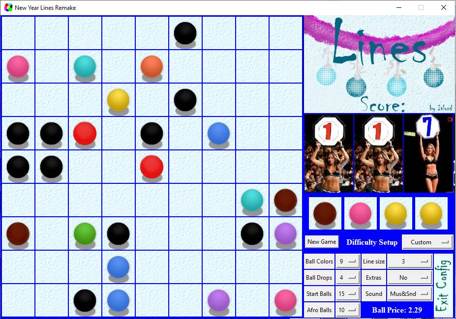

## Программирование
​Автор: Мазлов Иван
​<br><h3> Первый семестр </h3>
<p align="center">МИНИСТЕРСТВО НАУКИ  И ВЫСШЕГО ОБРАЗОВАНИЯ РОССИЙСКОЙ ФЕДЕРАЦИИ<br>
Федеральное государственное автономное образовательное учреждение высшего образования<br>
"КРЫМСКИЙ ФЕДЕРАЛЬНЫЙ УНИВЕРСИТЕТ им. В. И. ВЕРНАДСКОГО"<br>
ФИЗИКО-ТЕХНИЧЕСКИЙ ИНСТИТУТ<br>
Кафедра компьютерной инженерии и моделирования</p>
<br>
<h3 align="center">Отчёт по лабораторной работе № 3<br> по дисциплине "Программирование"</h3>
<br><br>
<p>студента 1 курса группы ИВТ-б-о-201(2)<br>
Мазлова Ивана Денисовича<br>
направления подготовки 09.03.01 "Информатика и вычислительная техника"</p>
<br><br>
<table>
<tr><td>Научный руководитель<br> старший преподаватель кафедры<br> компьютерной инженерии и моделирования</td>
<td>(&nbsp;&nbsp;&nbsp;&nbsp;&nbsp;&nbsp;&nbsp;&nbsp;&nbsp;&nbsp;&nbsp;&nbsp;&nbsp;&nbsp;&nbsp;&nbsp;&nbsp;&nbsp;&nbsp;&nbsp;&nbsp;&nbsp;&nbsp;&nbsp;&nbsp;&nbsp;&nbsp;&nbsp;&nbsp;&nbsp;&nbsp;&nbsp;)</td>
<td>Чабанов В.В.</td>
</tr>
</table>
<br><br>
<p align="center" > Симферополь, 2021</p>
<hr>


<h1>Лабораторная работа №3 Игра "Lines"<h1>

<h2>Цель:</h2>
<p>&nbsp;&nbsp;&nbsp;&nbsp;Закрепить навыки разработки программ с простым графическим интерфейсом пользователя на зыке Python при помощи библиотеки Tkinter;<br>&nbsp;&nbsp;&nbsp;&nbsp;Получить представление о разработке простых игровых приложений.</p>

<h2>Постановка задачи</h2>
<p>&nbsp;&nbsp;&nbsp;&nbsp;Используя стандартный модуль для разработки программ с графическим интерфейсом Tkinter реализуйте игру Lines на зыке Python.<br>&nbsp;&nbsp;&nbsp;&nbsp;В качестве образца графического интерфейса была использована <a href="http://game-shariki.ru/linii-2">данная игра</a>.<br>Подробности указаны далее.
</p>


<h2>Выполнение работы</h2>
<h3> 0. Изучение предоставленных материалов. Принятие решения.</h3><p>
&nbsp;&nbsp;&nbsp;&nbsp;В первую очередь я установил библиотеку Pillow и прочитал документацию по её основным функциям, ознакомился с методами её применения на практике, представленными научным руководителем в качестве примера. Я также изучил курс лекций по применению Tkinter на практике.<br>
&nbsp;&nbsp;&nbsp;&nbsp;Знаний по применению ООП не хватало, поэтому решено было писать обычным процедурным способом.<br>&nbsp;&nbsp;&nbsp;&nbsp;Пока я занимался изучением материала, младшая сестра (11 лет) тестировала представленную ссылку с игрой. Уровень игры был достаточно высокий и у неё ничего не получалось, что очень её расстраивало. Поэтому я подумал, что можно было бы сделать такой вариант игры, который можно было бы при необходимости настроить под разные уровни игроков: сделать проще или сложнее при желании. Ещё хотелось бы уйти от мрачных серых тонов и привязать дизайн интерфейса к новогодней тематике.

&nbsp;&nbsp;&nbsp;&nbsp;Окончательное решение делать не стандартный клон "Шариков", а что-то более весёлое я принял, когда прочитал в задании разрешение: 
```Дизайн игры изменять можно, но только в сторону эстетического улучшения (лучше получилось или хуже решает преподаватель :)).```</p>

<h3>I. Переработка игровой модели игры</h3>
<p>&nbsp;&nbsp;&nbsp;&nbsp; Модель игры была изменена и добавлены следующие элементы настройки. Можно выбрать:
<ul>
<li>количество вариантов цветов выпадающих шаров от 1 до 9 (7 в станартном варианте игры)</li>
<li>количество шаров появляющихся на каждом ходу от 1 до 4 (3 оригинале)</li>
<li>количество шаров на поле при старте игры (разовый вброс до 50% объёма поля)</li>
<li>длину линии для её уничтожения от 3 до 7 шаров (5 в оригинале)</li>
<li>опцию бонуса (+дополнителные очки ~%5) за закрытие более одной линии за один ход</li>
<li>опцию бонуса за превышение количества шаров больше необходимого (например, стоит установка, чтобы линия исчезала при пяти шарах, а вы сразу закрыли линию в 7 шаров: каждый шар свыше необходимого принесёт дополнительные очки</li>
<li>самое интересное на мой взгляд: чёрные шары. Их количество при старте тоже можно выбрать. Чёрные шары нельзя передвигать и они создают непреодолимые помехи на поле. Таким образом каждый раз у нас может быть по-новому сложное поле, что сильно меняет тактику игры</li>
</ul></p><p>
&nbsp;&nbsp;&nbsp;&nbsp;Естественно, что при таком сильном изменении уровней сложности нужно было как-то соблюсти баланс игры. Поэтому система подсчёта очков была изменена: чем сложнее настройка игры, тем больше очков можно получить за один шар, убранный с поля. Значение "Стоимость Шара" (Ball Price) рассчитывает сразу после изменения настроек сложности и для оригинальных настроек равно 2. Получился достаточно большой разброс от 0.02(детский уровень) до 27 очков за шар. Получилось вполне сбалансировано.
&nbsp;&nbsp;&nbsp;&nbsp;Очки считаются в переменной float, а на экран выводится только целая часть счёта. Счёт ограничен 1000, после достижения этого числа очков выводится поздравительное сообщение и игра заканчивается. Младшая сестра, например, играла не на самом слабом уровне и дошла до победы примерно за 35 минут.
&nbsp;&nbsp;&nbsp;&nbsp;Всю модель учета очков, конечно, за такой короткий промежуток протестировать, не удалось, но в целом вполне интересно играть. К отчету прилагается файл Excel с рассчётом новой модели игры.</p>

<p align="center"></p>
<p align="center">Рис 1. Рассчёт модели игры в Excel</p>

<p>&nbsp;&nbsp;&nbsp;&nbsp; В любом случае все эти нововведения легко можно отключить и играть в представленный для образца вариант Lines со стандартными: 5 шаров в ряд, 7 цветов и вброс 3 шара за ход.
<br></p>
<h3>II. Переработка дизайна игры</h3>
<p>&nbsp;&nbsp;&nbsp;&nbsp;Как я уже и сказал, хотелось сделать веселый аркадный вариант игры с новогодней тематикой и весёлой музыкой. Были нарисованы:
<ul>
<li>картинки для header-а и footer-а (который одновременно является "крышкой" для секции конфигурации</li>
<li>кнопка "Exit Config"</li>
<li>несколько новых моделей шариков</li>
<li>тени для анимации</li>
<li>заставки для конца игры</li>
<li>найдено особое решение для отображения счёта</li>
</ul>
&nbsp;&nbsp;&nbsp;&nbsp;Я немного "оживил" сами цифры счета и придал им, так сказать, человеческий облик (картинки вязты из открытых источников и немного доработаны для использования).
Вот какой дизайн получился:</p>
<p align="center"></p>
<p align="center">Рис 2. Новогодний дизайн интерфейса</p>

<p>&nbsp;&nbsp;&nbsp;&nbsp;В игру добавлена весёлая аркадная музыка и звук "невозможно перекатить шар"(больше не успел, но добавить уже не сложно). Музыку и звук можно отключить в настройках конфигурации (чтобы сохранить полную совместимость с образцом игры.)</p>

<h3>III. Меню конфигурации и управление.</h3>
<p>&nbsp;&nbsp;&nbsp;&nbsp;Ещё я сделал и расположил меню настроек конфигурации со всеми вышеперечисленными настройками. Секция конфигурации может быть скрыта footer-ом, чтобы открыть её, нужно по ней один раз кликнуть (закрывается кнопкой внутри). Есть "быстрое" меню выбора одного из "стандартных" вариантов игры: Noob, Standart (оригинал игры), Advanced, PRO и Inhuman (очень сложный). То есть можно и быстро выбрать какую-то стандартную настройку или в режиме Custom настроить любой параметр отдельно - создать свой вариант игры. Оба типа меню синхронизированы между собой (из-за этого пришлось вводить дополнительную стадию игры stage=4).
</p>
<p align="center"></p>
<p align="center">Рис 3. Начало игры. Выбор количества цветов шариков.</p>

<p>&nbsp;&nbsp;&nbsp;&nbsp;Из интерфейса была выкинута кнопка "Сделать ход" - сейчас, чтобы сделать ход можно просто нажать на пробел или кликнуть один раз на шарики "буфера подсказки". Кнопка "New Game" продублирована на клавишу Escape (если нажать, на Escape, начнётся новая игра.)</p>
<p align="center"></p>
<p align="center">Рис 4. Игра с чёрными шарами.</p>

<h3>IV. Пояснения по коду</h3>
<p>&nbsp;&nbsp;&nbsp;&nbsp;За основу создания и размещения графики в игре взяты предоставленные Научным Руководителем примеры. ООП не использовалось, кроме взятого из моего же задания №22 класса pf() (поиск пути в лабиринте). Пришлось сделать отдельную функцию подготовки данных из массива шариков на поле в формат, принимаемый классом pf().
&nbsp;&nbsp;&nbsp;&nbsp;Я посторался максимально структурировать код и вынес все отдельные действия в отдельные функции: Add_Balls() отдельно для каждого шарика обращается к Add_Ball, отдельно учитывается и отображается счёт - SetScore(), есть отдельные Restart_game() и Next_turn(), check_vectors() разбивает свои действия и обращается к рекурсивной функции one_vector() для поиска шаров в линии.
&nbsp;&nbsp;&nbsp;&nbsp;После каждой установки шарика на поле (кроме чёрных шариков) производится вызов проверки на заполненность поля и сформированность полной линии. 
&nbsp;&nbsp;&nbsp;&nbsp;Алгоритм определения заполненных линий работает по следующему принципу: установка шара может закрыть до четырёх линий одновременно:
<ul>
<li>диагональная: сверху слева и направо вниз (может быть в любой комбинации)</li>
<li>диагональная: сверху справа и влево вниз (может быть в любой комбинации)</li>
<li>горизонтальная и вертикальная (могут быть только буквой T, где через переечение могут проходить ещё и диагональные линии)</li>
</ul>
Поэтому от точки установки шара мы идём векторами во все восемь направлений, при этом результаты поиска суммируются по парам обратных векторов. Проход по лучу вектора делает рекурсивная функция one_vector(). После проверки результат возвращащается в виде list из list-ов, содержащем координаты клеток поля с найденными одноцветными шарами. Такая точность ответа позволяет применить сложную оценку длин закрытых линий и превышения количества шаров для начисления дополнительных бонусов (это включается в меню конфигурации).
&nbsp;&nbsp;&nbsp;&nbsp;Вся графика (кроме шаров и теней) скомпанована в один большой arts.JPG и вырезается из него методом .crop(). Вся подготовка графики производится в самом начале игры, включая наложение картинок методами .alpha_composite() и .paste(). Именно по причине наложения сами картинки шаров и теней находятся в PNG формате (где есть прозрачный фон).
&nbsp;&nbsp;&nbsp;&nbsp;Можно сказать, что лавна функция - это cfg_change(). Она обрабатывает нажатия на элементы поля в зависимости от текущего режима игры.
&nbsp;&nbsp;&nbsp;&nbsp;Дополнительно в пакете идёт ещё два звуковых файла: "ошибка переката шара" (OGG-формат) - для его озвучки удалось импортировать и запустить winsound, для проигрывания музыки я не нашел другого варианта, как импортиовать mixer из pygame.
&nbsp;&nbsp;&nbsp;&nbsp;Обращаю внимание, что без установленной библиотеки pygame музыка работать в игре не будет, более того, проверки на наличие pygame я не сделал и без неё сразу выдаст ошибку. Необходимо её установить - это займёт пару минут всего.
</p>
<p><br>Привожу полный код игры "New Year Lines Remake":</p>

```python
#!/usr/bin/python3
from tkinter import *
from PIL import Image, ImageTk
import random as rnd
#import pygame
from pygame import mixer
from winsound import * #import mp3play

class pf(): #       tuples=> (x,y) (x,y)      Оne step:    Up    Right   Down   Left      Стенки и препятствия
    def __init__(self, maze, start, end, update_model = ((0,-1), (1,0), (0,1), (-1,0)), blocks = [1, '#', '@']):
        self.found, self.end, self.maze, self.update_model, self.paths = [], end, maze, update_model, [[start]]
        self.upd_len        = len(self.update_model)                   #      path0                path1
        self.dot_sum        = lambda A, B: (A[0] + B[0], A[1] + B[1]) # [ [(x0,y0),(x0,y0)], [(x,y),... ,(x,y)]]
        self.good = set([(x, y) for y in range(len(maze)) for x in range(len(maze[y])) if maze[y][x] not in blocks])

    def do(self): # Полностью прокручивает весь поиск пути
        while self.paths and not self.found: self.paths = self.one_step([])
        return self.found

    def one_step(self, new_paths = []): # Плюс один шаг на всех "живых" путях (добавляет к каждому пути ещё точки)
        for path in self.paths:
            new_dots = set(map(self.dot_sum, [path[-1]] * self.upd_len, self.update_model)) & self.good
            self.good -= new_dots
            if self.end in new_dots:
                self.found = path + [self.end]
                break
            new_paths += [path + [dot] for dot in new_dots]
        return new_paths


a, size_y, size_x=[], 9, 9
an_loop=[]; cur_score=100
stage=0
need_restart=True
# Стадии игры:
# 0: - Клик (Шар не выбран)
#  - по шару -> выбирает шар (Afro Ball - нет реакции)
#  - по пустоте -> нет реакции
#  - New Game -> перезапуск
#  - По шарикам подсказки (или пустому полю, если нет шара подсказки) -> добавление N шаров по настройкам
#  - Config -> открывает конфиг, кнопка Exit Config или Ball Price - закрывают конфиг
#
# 1-шар выбран:
#   -Клик   - по выранному шару или по Afro Ball - нет реакции
#           - по другому шару - перевыбор шара
#           - по пустому месту: запуск процедуры проката шара с проверками
# 2-прокат шара, проверки, стирание, обновление help - нет реакции ни на какие клики по полю
#
# 3 - GameOverWait ждем нажатия New Game
# 4 - Временный режим конфига, чтобы исключить повторные срабатывания dropdown-ов
# !! Выборы режима сложности и New Game - ведут сразу к перезапуску игры и кликабельны в любой стадии

#  0 1 2 3 4 5 6 7   8
s=[7,3,3,0,5,1,1,2, True] # config status 'Standart' - с него всегда начинаем первый запуск игры
# Легенда config status
#[0] - кол-во цветов,
#[1] - количество шаров на выброс
#[2] - количество шаров на поле после старта игры
#[3] - количество афро-американских шаров (их нельзя двигать),
#[4] - длина заполненной линии (от 3 до 7 шаров)
#[5] - ExtraBallBonus - добавление бонусных очков за дополнительные шары сверх длины линии
#[6] - MultiLineBonus - добавление бонусов за закрытие больше одной линии сразу (2-3 линии)
#[7] - множитель счёта - сколько очков давать за один шар (высчитываемый в зависимости от сложности игры показатель)
#[8] - звуковые эффекты включены\выключены  True\False

# Меню конфига. Модель выбора режимов сложности и пересчёта стоимомти шара, отключение музыки.
model=[ # widget, var, label_text, default choice, model{}dropdown
#0  1         2        3       4
[0, 0, 'Ball Colors', '7', {'1':0.15,   '2':0.25,    '3':0.37,    '4':0.50,   '5':0.65,   '6':0.80, '7':1.00, '8':1.20, '9':1.50}],
[0, 0, 'Ball Drops',  '3', {'1':0.30,   '2':0.60,    '3':1.00,    '4':1.50}],
[0, 0, 'Start Balls', '3', {'3':1.00,  '10':1.10,   '15':1.20,   '25':1.32,  '40':1.50}],
[0, 0, 'Afro Balls',  '0', {'0':1.00,   '1':1.10,    '3':1.25,    '5':1.45,  '10':1.70,  '15':2.00}],
[0, 0, 'Line size',   '5', {'3':0.25,   '4':0.55,    '5':1.00,    '6':1.40,   '7':2.00}],
[0, 0, 'Extras',     'No', {'No':0,     'All':3,     'Balls+':1,  'Lines+':2}],
[0, 0, 'Sound', 'Mus&Snd', {'Mus&Snd':3,'Mute All':0,'No Music':1,'No Sound':2}]
]
# Стандартный набор режимов сложности для быстрого старта
preset = {'Custom': [],               'Noob':[5,1, 3, 0,3,0,0], 'Standart':[7,3, 3, 0,5,0,0],
          'Advanced':[7,3,10,5,5,0,0], 'PRO': [7,4,10,10,5,1,1], 'Inhuman': [7,4,15,15,5,1,1]}

def cfg_change(event, i1, i2, m, *args):# обработка изменения dropdown-ов конфига
    global s, stage
    if stage==4: return
    g=model[m][1].get()
    if g not in model[m][4]: return                      # -  непонятно, что это такое - нет ключа
    if m==6:                                             # 6. Music and sound setup
        if model[m][4][g]&2: mixer.music.play(loops=-1)  #     music on  #pygame.
        else: mixer.music.stop()                         #     music off  #pygame.
    else:                                                # Другие настройки
        if not isinstance(s, list) or len(s)!=8: s=[0]*8 # контроль настроек на всякий случай
        for i in range(5):                               # забираем все настрйки
            s[i]=int(model[i][1].get())

        extras=model[5][1].get()
        s[5]=int(bool(model[5][4][extras]&1)) # bin x?  [5]-ExtraBalls+  (active for 3, 1)
        s[6]=int(bool(model[5][4][extras]&2)) # bin ?x  [6]-ExtraLines+  (active for 3, 2)

        s[7]=2
        for i in range(5):
            s[7]*=model[i][4][str(s[i])]
        ball_pice["text"] = 'Ball Price: '+ str(int(s[7]*100)/100)
        stage=4
        tkvar.set('Custom')
        stage=0
        Restart_game(None)

def change_dropdown(*args): # обработка выбора стандартных режимов сложности
    global s, model, stage
    if stage==4: return
    s=preset[tkvar.get()]
    if not s:            # Если выбран Custom, то обновляем настройки из других dropdown
        #s=[0, 0, 0, 0, 0, 0, 0, 0]
        cfg_change(None,None,None, 0)
        return

    s.append(2) # base ball price
    stage=4
    for i in range(5):
        s[7]*=model[i][4][str(s[i])]
        model[i][1].set( str(s[i]) )
    ball_pice["text"], stage = 'Ball Price: '+ str(int(s[7]*100)/100), 0
    Restart_game(None)

# Анимация шаров и 4-е стандартных варианта, но можно ещё каке-то сделать
# Selected: blink 1+2+3 sprites   an((x,y), pic[color_0-6][:4][::-1] + pic[color_0-6][:4], idx=0, loop=2, delay=40)
# Animate AddBall: an((x,y), pic[color][::-1], idx=0, delay=40) #reversed()
# Animate DelBall: an((x,y), pic[color], idx=0, delay=40)
# Animate mark path: an((x,y), pic[color][::-1][:4] + pic[color][4:], idx=0, loop=0, delay=40)
def an(point, slides, idx=0, loop=0, delay=30): # Slide animation
    global a, an_loop
    x,y = point #                                                                                4- max длина help
    if  (not 0<=idx<len(slides)) or (not -1<=y<len(a)-1 ) or (not 0<=x<len(a[y])) or (y<0 and x>=4): return
    a[y][x].configure(image=slides[idx])
    idx+=1
    if idx>=len(slides):
        if point in an_loop:
            if   loop==1: idx=0 # cicle loop
            elif loop==2:       # reverse loop
                slides=slides[::-1]
                idx=0
        elif a[y][x]["image"]==bg_cell_empty and a[y][x].color!=0:  #
            a[y][x].configure(image=pic[ a[y][x].color ][0])   # проверка на непрорисовки
        elif a[y][x]["image"]!=bg_cell_empty and a[y][x].color==0:  #
            a[y][x].configure(image=bg_cell_empty)            #

    root.after(delay, an, point, slides, idx, loop, delay)

def but_one_press(event, x, y): #Обработка кликов по игровому полю
    global a, an_loop, stage, cur_score, s, model
    if stage==3: return
    clr=a[y][x].color
    if 0<clr<=9: # выбор или перевыбор шара
        if an_loop and an_loop[0]==(x,y): return
        an_loop=[(x,y)]
        an((x,y), pic[clr][:3] + pic[clr][:3][::-1] , idx=0, loop=2, delay=60)
        stage=1

    elif (stage==1 and clr==0): # попытка перекатить шар
        ball=an_loop[0]
        ball_clr=a[ball[1]][ball[0]].color
        path = pf_do(ball, (x,y))
        if not path:
            if model[6][4][model[6][1].get()]&1: snd.play() # звуковые эффекты включены? Error sound
            return
        stage, an_loop=2, []
        Del_Ball(ball, anim=True, delay=60)
        a[ball[1]][ball[0]].color=0

        Add_Ball((x,y), ball_clr, anim=True, delay=20)#30
        a[y][x].color=ball_clr
        [an((i[0],i[1]), pic[ball_clr][::-1][:4] + pic[ball_clr][4:], idx=0, loop=0, delay=20) for i in path[1:-1]]

        res=CheckLineReady((x,y))
        stage=0
        if not res:
            Add_Balls(s[1])
        CheckGameOver()

def CheckGameOver(): # Проверка конца игры: нет пустых клеток(проигрыш) или достигнуто 1000 очков(победа)
    global a, stage, cur_score
    if not Free_cells():
        game_over.configure(image=go_lose)
        game_over.place(x=125, y=20)
        stage=3
    elif cur_score>=999:
        SetScore(999, cur_score)
        cur_score=999
        game_over.configure(image=go_win)
        game_over.place(x=20, y=20)
        stage=3

def CheckLineReady(point): # проверка, привела ли перестановка\добавление шара к полным линиям
    global a, cur_score, s
    if a[point[1]][point[0]].color==0: return True
    res=check_vectors(point)
    multi_line_bonus=1
    extraball_per_line=0
    if res:
        multi_line_bonus=(1.05)**(len(res)-1) if s[6] else 1 # подсчёт одновременно закрытых линий *1.05 за линию
        extraball_per_line=s[5]*sum([sum([s[7]*((1.05)**(i+1))-s[7] for i in range(len(v)-s[4])]) for v in res if len(v)>s[4]])
    res=set(p for v in res for p in v)
    if res:
        ald_score=cur_score
        cur_score=cur_score + len(res)*s[7]*multi_line_bonus + extraball_per_line
        SetScore(cur_score, ald_score)
        [Del_Ball(i, anim=True, delay=25) for i in res] #35
        return True
    return False

# Подготовка формата лабиринта, чтобы можно было использовать PathFinding из задания 22
def pf_do(start, end, blocks = [1,2,3,4,5,6,7,8,9,10,11,12,13,14,15]):
    global a
    maze=[[x.color for x in y] for y in a]
    lab = pf(maze, start, end, blocks = blocks)
    return lab.do()

# поиск шаров одинакового цвета по одному "лучу".
def one_vector(p, m, color):
    global a
    if not 0<=p[0]<size_x or not 0<=p[1]<size_y or a[p[1]][p[0]].color!=color: return []
    return [p] + one_vector((p[0]+m[0], p[1]+m[1]), m, color)

# Поиск шаров одинакового цвета от заданной точки в восемь сторон, чтобы понять, заполнена ли линия
def check_vectors(p, star_model=[[1,1], [1,-1], [1,0], [0,1]]):
    global a, s
    res, clr = [], a[p[1]][p[0]].color
    for v in star_model:
        tmp_res = one_vector( (p[0]+v[0], p[1]+v[1]), v, clr)
        tmp_res+= one_vector( p, [-v[0], -v[1]], clr)
        if len(tmp_res)>=s[4]: res.append(tmp_res)
    return res

def SetScore(num, ald_num): # вращение девушек: отображение счёта
    global score
    if num>=999: num=999
    if num<0 or int(ald_num)==int(num): return
    ald_num+= -1 if int(ald_num)>int(num) else 1
    for i in range(3): score[2-i].configure(image=girls[int(ald_num)//(10**i)%10])
    root.after(2 if abs(num-ald_num)>50 else 15, SetScore, int(num), ald_num)

# анимация крышки конфига. можно использовать чтобы двигать и другие объекты как захочется
def anS(event, wig, cur_pos, zone, shift, delay=30, mode=True): #mode: True-if ANY cord out of zone, False-if both out
    global need_restart
    x,y,minX,minY,maxX,maxY=*cur_pos,*zone[0],*zone[1]    # zone=[[minX,minY], [maxX,maxY]] , shift=[+x,+y]
    xOk,yOk=(minX<=x<=maxX), (minY<=y<=maxY)        # cur_pos=[x,y]
    if (mode and not (xOk and yOk)) or not (mode or xOk or yOk): return
    wig.place(x=x, y=y)
    cur_pos=[x+shift[0], y+shift[1]]
    root.after(30, anS, event, wig, cur_pos, zone, shift, delay, mode)

def Clean_field(): # полная очистка поля
    global an_loop, a
    an_loop=[]
    for y in range(len(a)):
        for x in range(len(a[y])):
            if a[y][x].color!=0:
                an((x,y), pic[a[y][x].color], idx=0, delay=30)
                a[y][x].color=0

def Free_cells(): # list со свободными клетками игрового поля
    return [ (x,y) for y in range(len(a)) for x in range(len(a[y])) if a[y][x].color==0 and y<=8]

def Next_turn(event): # сгружает шары из Хелпа но поле (после клика на очередь шаров)
    global a, an_loop, stage, s
    if not Free_cells() or stage==2 or stage==3: return
    if not 1<=s[1]<=4: s[1]=3
    Add_Balls(s[1])
    an_loop=[]
    stage= 0
    CheckGameOver()

def Restart_game(event):
    global a, cur_score, an_loop, stage, s
    if stage==2: return
    an_loop, stage = [], 2
    if not 1<=s[1]<=4: s[1]=3
    ald_score, cur_score=cur_score,0
    Clean_field() ; game_over.place_forget() ; SetScore(cur_score, ald_score)
    for y in range(len(a)):
        for x in range(len(a[y])):
            a[y][x].configure(image=bg_cell_empty)
            a[y][x].color=0
    RestockHelp()
    Add_Balls(max(s[1],s[2]))
    if s[3]: Add_Balls(N=s[3], must=[13]) # add afro-american balls
    stage=0

def Add_Ball(point, color, anim=True, delay=20):
    global a
    a[point[1]][point[0]].color=color
    if anim: an(point, pic[color][::-1],  delay=delay)
    else:    an(point, [ pic[color][0] ], delay=delay)

def Del_Ball(point, anim=True, delay=20):
    global a
    clr=a[point[1]][point[0]].color
    a[point[1]][point[0]].color=0
    if anim: an(point, pic[clr], delay=delay)
    else:    an(point, [ pic[clr][-1] ], delay=delay)

def RestockHelp():
    global a, s
    if not 1<=s[1]<=4: s[1]=3
    for i in range(s[1]):
        Add_Ball((i,-1), rnd.randint(1, s[0]), anim=True, delay=60 )

def Add_Balls(N=3, must=[]):
    global a, s
    free=Free_cells()
    N=min(N, len(Free_cells()))
    if must: stock=[rnd.sample(must,1)[0] for i in range(N)]
    else:
        stock=[a[-1][s[1]-1-i].color for i in range(min(s[1],N))]
        if N-s[1]>0: stock+=[rnd.randint(1, s[0]) for i in range(N-s[1])]
    free_sample=rnd.sample(free, N)
    for i in range(N):
        Add_Ball(free_sample[i], stock[i], anim=True, delay=70)
        CheckLineReady(free_sample[i])
    RestockHelp()

#pygame.mixer.init() ; pygame.mixer.music.load("sound.mp3") ; pygame.mixer.music.play(loops=-1) #loops=0
#snd = pygame.mixer.Sound('Error.ogg') #f = mp3play.load('Error.ogg'); f.play()

mixer.init() ; mixer.music.load("sound.mp3") ; mixer.music.play(loops=-1) #loops=0
snd = mixer.Sound('Error.ogg') #f = mp3play.load('Error.ogg'); f.play()

root = Tk()
root.title("New Year Lines Remake")
root.geometry('%dx%d+%d+%d' % (924,616,200,100)) #('924x616+200+100')

root.configure(bg='blue')
root.resizable(0, 0) #root.overrideredirect(1)
root.iconbitmap('icon.ico')

pic={0:[Image.open("bg_cell.png").convert('RGBA').crop((0, i*67, 66, i*67+66)) for i in range(8)]} #
bg_cell_empty=ImageTk.PhotoImage(pic[0][7])

pic_size_same_as_bgr = Image.new("RGBA", (66,66))
balls_img=Image.open("balls.png")

for i in range(14): # balls: 0-8 цветные шары, 12-афроамериканский
    pic[i+1]=[]
    for j in range(7):                                      # ball images for one color
        ball = balls_img.crop((0+i*55, j*57, 54+i*55, j*57+56)).convert('RGBA')
        ball_over_bgr = Image.alpha_composite(pic[0][j], pic_size_same_as_bgr)
        ball_over_bgr.paste(ball, (5,7), ball) #
        pic[i+1].append(ImageTk.PhotoImage(ball_over_bgr))
    pic[i+1].append(bg_cell_empty) # последним после маленького идёт пустой фон

f  = Frame(root, width=600, height=616, bg='blue', bd=2)
f2 = Frame(root, width=300, height=170, bg='blue', bd=0) # Header right col
f3 = Frame(root, width=300, height=170, bg='blue', bd=1) # Girls:Score
f4 = Frame(root, width=100, height= 85, bg='blue', bd=0) # for HELP next balls
f5 = Frame(root, width=300, height=150, bg='blue', bd=0) # for Buttons
f6 = Frame(root, width=300, height=150, bg='blue', bd=0) # for Buttons

f.pack(side=LEFT)
f2.pack(side=TOP)
f3.pack(side=TOP)
f4.pack(side=TOP, fill=X) #,padx=20
f5.pack(side=TOP, fill=X) #
f6.pack(side=BOTTOM, fill=BOTH)

# Основное поле
for y in range(size_y):
    a.append([])
    for x in range(size_x):
        a[y].append(Label(f, image = bg_cell_empty, bd=0))
        a[y][x].bind("<Button-1>", lambda event, x=x, y=y: but_one_press(event, x, y) )
        a[y][x].grid(row=y, column=x, padx=1, pady=1, sticky = 'nesw')
        a[y][x].cord = (x,y)
        a[y][x].color = 0 #rnd.randint(0,s[0]) #0
        an((x,y), pic[a[y][x].color][::-1], idx=0, delay=40)   #a[y][x].configure(image=pic[a[y][x].color][0])

arts=Image.open("arts.jpg") # графика игры: шапка, футер, кнопка, выигрыш, проиргыш
# Шапка
sc_main = ImageTk.PhotoImage(arts.crop((614,0,922,199)).convert('RGBA'))
Label(f2, image = sc_main, bd=0).pack(side=TOP, padx=0, pady=0)

# Game Over
go_lose=ImageTk.PhotoImage(arts.crop((380,0,614,379)).resize((350,563)))
go_win=ImageTk.PhotoImage(arts.crop((0,0,379,379)).resize((563,563)))
game_over=Label(f, image = go_lose, bd=3)
game_over.bind("<Button-1>", Restart_game)


# Score-girls ########################################
score = []
girls={x:ImageTk.PhotoImage(arts.crop((x*100,380,x*100+99,540)) ) for x in range(10)}#, Image.ANTIALIAS
for i in range(4):
    score.append(Label(f3, image = girls[0], bd=0))
    score[i].pic=0
    score[i].grid(row=3, column=i, padx=1, pady=1, sticky = 's') #sticky = 'nesw'

# Help balls ########################################
Label(f4, text="", bg = "blue", bd=0, font=("Times", 28, 'bold'), fg='black').pack(side=LEFT, padx=3, pady=3)
a.append([]) # последняя линия - невидимая на поле - линия подсказки
for i in range(4):
    a[-1].append(Label(f4, image = bg_cell_empty, bd=0)) #, justify=CENTER bg = "blue",
    a[-1][i].color=0
    a[-1][i].bind("<Button-1>", Next_turn)
    a[-1][i].pack(side=LEFT, padx=3, pady=7) #

root.bind("<space>", Next_turn)

Restart=Button(f5, text="New Game")
Restart.bind("<Button-1>", Restart_game)
root.bind('<Escape>', Restart_game)
Restart.pack(side=LEFT, padx=3, pady=3)

tkvar = StringVar(root) # Create a Tkinter variable
tkvar.set('Standart') # set the default option
popupMenu = OptionMenu(f5, tkvar, *preset)
popupMenu.config(width=10)
popupMenu.pack(side=RIGHT, padx=3, pady=3)
Label(f5, text="Difficulty Setup", font=("Times", 12, 'bold'), bg='blue', fg='white').pack(side=RIGHT, padx=3, pady=3)
tkvar.trace('w', change_dropdown) # link function to change dropdown

# Config menu
for i in range(len(model)):
    Label(f6, text=model[i][2]).grid(row=i-(i//4)*4, column=0+(i//4)*2, padx=1, pady=1, sticky = 'nesw')
    model[i][1] = StringVar() #BooleanVar, DoubleVar, IntVar, StringVar  StringVar(root)??
    model[i][1].set(model[i][3])
    model[i][0]=OptionMenu(f6, model[i][1], *model[i][4])
    model[i][0].grid(row=i-(i//4)*4, column=1+(i//4)*2, padx=1, pady=1, sticky = 'nesw')
    model[i][0].config(width=1+(i//4)*7, height=1)
    model[i][1].trace('w', lambda event, i1, i2, i=i: cfg_change(event, i1, i2, i) )

# Close config button
exit_footer_img = ImageTk.PhotoImage(arts.crop((923,0,962,119))) #.convert('RGBA')
exit_footer = Label(f6, image = exit_footer_img, bd=0)
exit_footer.grid(row=0, column=5, rowspan=4, padx=1, pady=1, sticky = 'nesw')

# ball_pice
ball_pice = Label(f6, bd=0, text='Ball Price: 2.00', font=("Times", 12, 'bold'), bg='blue', fg='white')
ball_pice.grid(row=3, column=2, columnspan=2, padx=1, pady=1, sticky = 'nesw')

# Крышка конфига
footer = ImageTk.PhotoImage(arts.crop((614,200,922,369))) #.convert('RGBA')
options_cover=Label(root, image = footer, bd=0)
options_cover_up=[options_cover, [616,618], [[616,448],[616,618]], [0,-10]]
options_cover_dn=[options_cover, [616,448], [[616,448],[616,618]], [0, 10]]
options_cover.bind("<Button-1>", lambda event: anS(event, *options_cover_dn))
f6.bind("<Button-1>", lambda event: anS(event, *options_cover_up))
exit_footer.bind("<Button-1>", lambda event: anS(event, *options_cover_up))
ball_pice.bind("<Button-1>", lambda event: anS(event, *options_cover_up))
root.after(30, anS, None, *options_cover_up)

Restart_game(None)
root.mainloop()
```

<h3>V. Развитие проекта</h3>
<p>&nbsp;&nbsp;&nbsp;&nbsp;Ещё, возможно, реализовать дополнительные игровые элементы, такие, как:
<ul>
<li>призы с очками (нужно накатить шар определенного цвета и получить бонус. ход при этом не теряется)</li>
<li>кирки, чтобы убирать чёрные шары</li>
<li>портал для поглощения ненужных шаров</li>
<li>случайные события (например выброс чёрного шара в процессе игры)</li>
<li>особый режим игры, где убирать можно только по две (или более) пересекающиеся линии иначе шары не исчезают</li>
<li>сохранение таблицы рекордов и последней настройки конфигурации</li>
<li>доработать дизайн и поменять все dropdown-ы и кнопку New Game на красивые картинки</li>
<li>сделать русскоязычный вариант игры</li>
<li>сделать детскую настройку интерфейса, где вместо красивых девченок будут мишки, пингвины, олени и прочие детские рисунки (так как на лёгких настройках эта игра может быть интересна и маленьким детям тоже)</li>
</ul>
&nbsp;&nbsp;&nbsp;&nbsp;Под эти цели я оставил резервные позиции в картинках шариков с 10-12 и 14.
&nbsp;&nbsp;&nbsp;&nbsp;Ещё, наверное, нужно будет увеличить максимальный счёт до 4 значимых цифр и установить разные значения счёта для разных режимов сложности.
&nbsp;&nbsp;&nbsp;&nbsp;После экзаменов попробую найти время и доработать что-то.
</p>

<h2>Вывод</h2>
<p>&nbsp;&nbsp;&nbsp;&nbsp;В ходе работы я ознакомился с достаточно несложным графическим интерфейсом Tkinter и модулем Pillow, с помощью которых мне удалось написать переделку игры Lines, сделать её более веселой и интересной. Таким образом я потренировался создавать и рассчитывать баланс в новой игре, рисовать под неё графическое оформление и придумывать новый функционал. <br>
&nbsp;&nbsp;&nbsp;&nbsp;Пожалуй, это была самая интересная из всех трёх лабораторных работ, которые мы делали в этом семестре. И ещё мне очень понравилось, что эту работу нужно было сделать на Python и для этого нужно было изучить много информации, перечитать разных форумов в поисках решения для сложных вопросов. А это очень полезный опыт! </p>

<p>Кстати, вот так ласково игра провожает проигравших!</p>
<p align="center"></p>
<p align="center">Рис 5. Новогодний дизайн интерфейса</p>

<p>Большое спасибо!</p>
