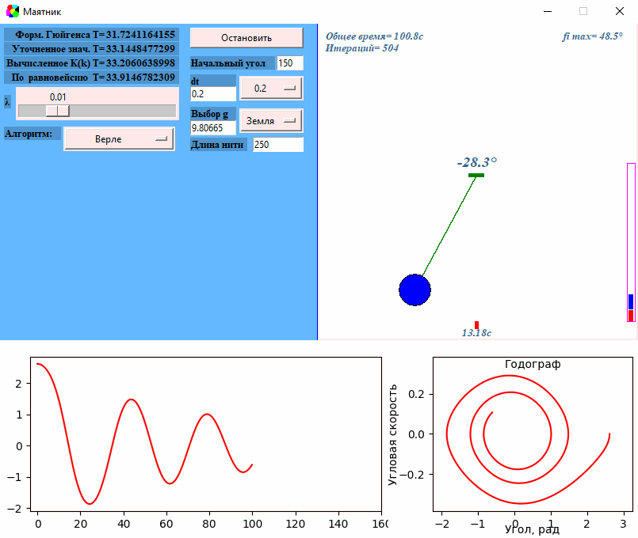

​Автор: Мазлов Иван

<h1>
Численное моделирование физического процесса колебания математического маятника в разных гравитационных системах. (2021 г.)
</h1>
<h4>

<h2>Краткий обзор.</h2>
<ul>
    <li>выполнено моделирование физического процесса колебания на Python 3 (библиотка Tkinter);</li>
    <li>настройки меню позволяют выбрать:
        <ul>
            <li>начальный угол отклонения - 𝜑0 ;</li>
            <li>коэффициент затухания - λ ;</li>
            <li>ускорение свободного падения системы;</li>
            <li>шаг дискретизации по времени ;</li>
            <li>длину невесомого стержня (или нити) – L ;</li>
            <li>математический алгоритм вычисления положения маятника во времени ;</li>
        </ul>
    </li>
    <li>графики:
    <ul>
            <li>колебаний маятника отображает динамику изменения угла отклонения по времени;</li>
            <li>Годограф и отображает взаимосвязь угловой скорости и угла отклонения;</li>
            <li>на гистограмме отображено изменение полной энергии маятника: красным столбиком отображается потенциальная энергия Ep, а синим – кинетическая Ek;</li>
    </ul>
    </li>
    <li>вычисляется перод колебания по разным формулам;</li>
</ul>
 

 

 

</h4>
&nbsp;&nbsp;&nbsp;&nbsp;