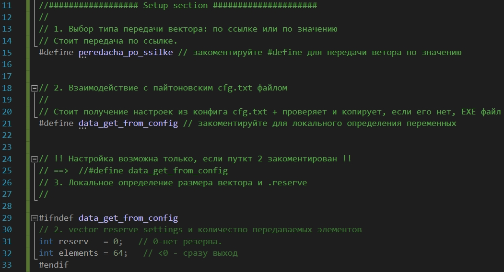
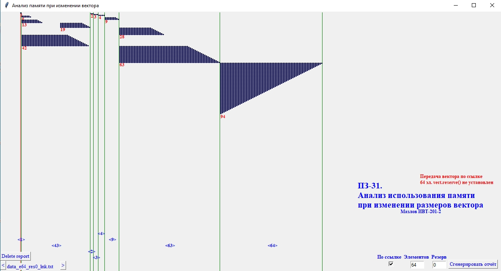
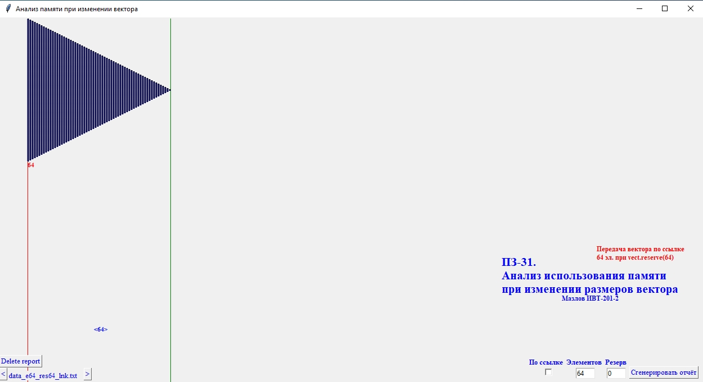
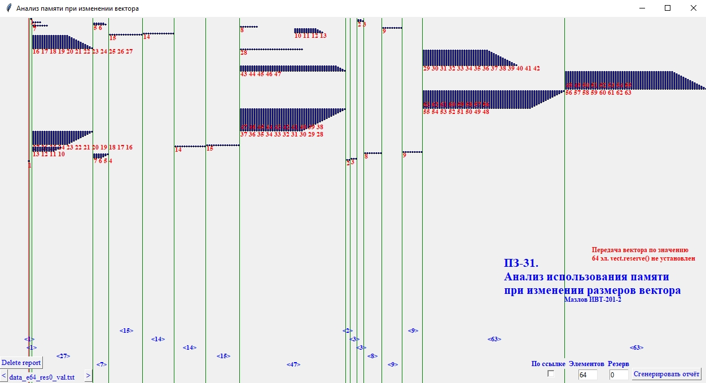
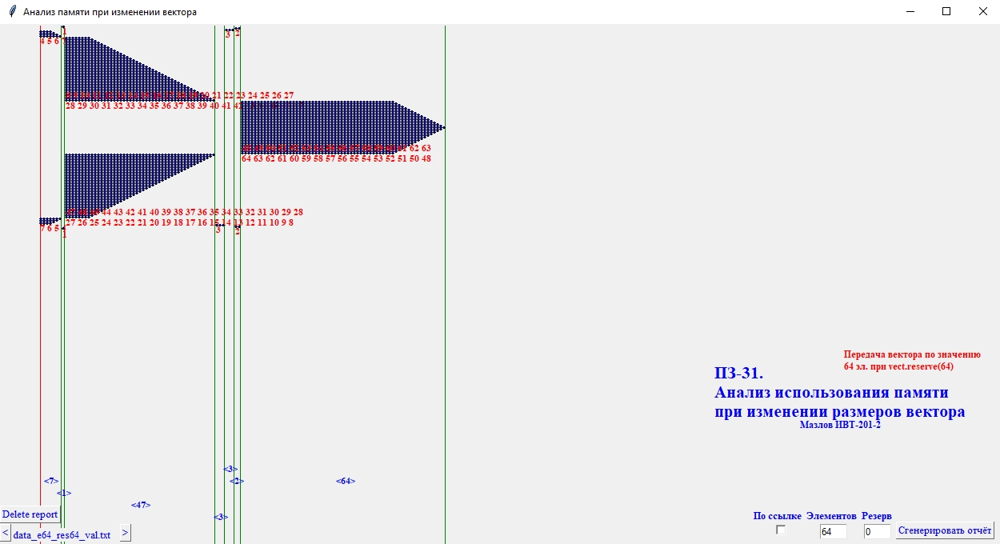

## Программирование
Автор: Мазлов Иван
 <h3> Первый семестр </h3>

МИНИСТЕРСТВО НАУКИ  И ВЫСШЕГО ОБРАЗОВАНИЯ РОССИЙСКОЙ ФЕДЕРАЦИИ 
Федеральное государственное автономное образовательное учреждение высшего образования 
"КРЫМСКИЙ ФЕДЕРАЛЬНЫЙ УНИВЕРСИТЕТ им. В. И. ВЕРНАДСКОГО" 
ФИЗИКО-ТЕХНИЧЕСКИЙ ИНСТИТУТ 
Кафедра компьютерной инженерии и моделирования

 
<h3 align="center">Отчёт по практическому занятию №31  по дисциплине "Программирование"</h3>
  

студента 1 курса группы ИВТ-б-о-201(2) 
Мазлова Ивана Денисовича 
направления подготовки 09.03.01 "Информатика и вычислительная техника"

  
<table>
<tr><td>Научный руководитель  старший преподаватель кафедры  компьютерной инженерии и моделирования</td>
<td>(&nbsp;&nbsp;&nbsp;&nbsp;&nbsp;&nbsp;&nbsp;&nbsp;&nbsp;&nbsp;&nbsp;&nbsp;&nbsp;&nbsp;&nbsp;&nbsp;&nbsp;&nbsp;&nbsp;&nbsp;&nbsp;&nbsp;&nbsp;&nbsp;&nbsp;&nbsp;&nbsp;&nbsp;&nbsp;&nbsp;&nbsp;&nbsp;)</td>
<td>Чабанов В.В.</td>
</tr>
</table>
  

 Симферополь, 2021

<h1>Текущий Контроль-4. Практическое занятие-31.  Адреса.<h1>

 
<h3>0. Общая информация.</h3>
&nbsp;&nbsp;&nbsp;&nbsp;Для более наглядного анализа выделения памяти под увеличивающийся и уменьшающийся вектор я написал программу на пайтоне, которая анализирует промежутки памяти при разных размерах вектора и отображает всё в графическом виде при помощи библиотеки Tkinter и виджета Canvas. Выводятся распределение памяти по адресам с указанием текущей длины вектора и его текущей ёмкости (.capacity() ), размеров блоков использованной памяти. При таком отображении проще понять и изучить данный процесс.
Из-за этого мне пришлось немного изменить структуру выводимых данных, чтобы было удобней читать эти данные из приложения на пайтоне.
  
<h3>1. Приложение на пайтоне</h3>
В приложении <b>vector_address_chart.py</b> можно:
<ul>
<li>просматривать уже созданные файлы отчётов</li>
<li>создавать новые отчёты с новыми стартовыми настройками вектора:</li>
<ul>
<li>размером,</li>
<li>установленной .capacity() при инициализации,</li>
<li>типом передачи константно: по ссылке или по значению</li>
</ul>
</ul>
При создании нового отчёта приложение сохраняет данные в cfg.txt для запуска приложения на с++. Выбирается для запуска соответствующий скомпилированный EXE файл: 
<ul>
<li>Zadanie_31_val.exe - для передачи по значению</li>
<li>Zadanie_31_lnk.exe - для передачи по ссылке</li>
</ul>
&nbsp;&nbsp;&nbsp;&nbsp;EXE файл (на с++) проводит соответствующую операцию по созданию и передаче вектора и сохраняет данные в отчёт вида:  data_e<количество элементов вектора>_res<размер резерва>_<lnk-по ссылке, val-по значению>.txt
Приложение на пайтоне читает отчёт и выводит его в графическом виде.
Управление просмотром и созданием отчёта достаточно простое и не требует дополнительного объяснения.
Размер создаваемого вектора ограничен 100 элементами и резервная ёмкость ( .capacity() ) тоже ограничена 100.

<h3>2. Приложение на с++</h3>
В зависимости от внутренних настроек получает данные из cfg.txt или из инициализационных переменных, формирует вектор, передаёт его и сохраняет данные в отчёте.
Можно вносить изменения в конфиг-секции с++ приложения:
 

Рис 1. Конфиг с++ приложения

 
1. #define peredacha_po_ssilke - передача вектора будет идти по ссылке, если закоментировать эту строку, то передача будет идти по значению.

2. #define data_get_from_config - получение настроек вектора будет идти из файла cfr.txt, если закоментировать, то из Setup секции с++ приложения (именно тогда её можно настроить)

3. Только, если закоментирован пункт 2. Можно настроить стартовый размер вектора и его стартовую .capacity().

&nbsp;&nbsp;&nbsp;&nbsp;Если включен пункт 2 - получение данных из конфига, то с++ приложение попытается скопировать в корень проекта откомпилированный EXE файл соответствующего типа: для "по ссылке" и "для по значению" (они оба нужны для работы приложения на пайтон в режиме создания новых отчётов).

&nbsp;&nbsp;&nbsp;&nbsp;Вы можете или воспользоваться уже имеющимися EXE или стереть их и <b>пересоздать заново</b>: сначала запускаете как есть, потом комментируете первый пункт и запускаем ещё раз. Теперь пайтон сможет работать нормально.
 

<h3>3. Анализ результатов работы программы на пайтоне и ответы на вопросы.</h3>

&nbsp;&nbsp;&nbsp;&nbsp;Вот, что получилось при обработке адресов, занимаемых вектором при его увеличении и уменьшении при передаче вектора размером 64 элемента и (.capacity() ) по ссылке:
 

Рис 2. Использование памяти при передаче по ссылке без .capacity()

 

<h4>Тут и далее: </h4>
- на рисунках синим снизу указан размер блока памяти (задействованный!) в элементах (4 байта на элемент), а красным сверху текущая ёмкость вектора. 
- Если указана одна красная цифра, значит у всех элементов в этом блоке она одинаковая. 
- Если много цифр то это изменение ёмкости по рядам сверху вниз и значений ёмкости справа налево соответственно.
- вертикальные линии ограничивают блоки !использованной! (может не совпадать с выделенной) памяти. Не обязательно эти блоки стоят встык - один за одним - между ними может быть приличных размеров другой "не векторовский" блок памяти. Я убрал промежутки для компактности отображения. Но все выведенные блоки памяти отсортированы в порядке возрастания адресов.
 
&nbsp;&nbsp;&nbsp;&nbsp;Память выделяется блоками. Подыскивается подходящий по размеру блок и он выделяется для размещения элементов вектора. Пока вектор имеет небольшой размер с++ удаётся расположить его в "мелких" сегментах памяти. Мы видим картину, когда вектора длиной 6-13-42 и 28-63 используют сегмент памяти, начинающийся с одного адреса, но при этом два соседних по размерам "переноса" никогда не используют один и тот же участок памяти. Иначе невозможно было бы произвести копирование данных, не затирая предыдущее значение вектора.
По мере возрастания вектора с++ должен обеспечить непрерывность элементов в памяти и вынужден искать всё большие непрерывные участки памяти. 
&nbsp;&nbsp;&nbsp;&nbsp;<b>Общий принцип такой:</b> с++ подыскивает подходящий участок памяти, который, <b>больше текущей ёмкости вектора на 50%</b> и продолжает, постепенно добавляя элементы, двигаться к концу этого свободного участка. Как только участок заканчивается, подыскивается другой подходящий по размеру свободный участок памяти (1.5 размера именно текущей ёмкости) и туда производится перенос всех элементов вектора. 
 &nbsp;&nbsp;&nbsp;&nbsp;Таким образом обеспечивается неразрывность ряда вектора.
Если при иницализации вектора не изменять его стартовую ёмкость, то при увеличении вектора она будет изменяться по следующему ряду значений ёмкости: 
1 -> 2 -> 3 -> 4 -> 6 -> 9 -> 13 -> 19 -> 28 -> 42 -> 63 -> 94 и т.д. 
 &nbsp;&nbsp;&nbsp;&nbsp;Как только количество элементов становиься больше, чем capacity, выделяется новый кусок памяти, вектор копируется и продолжает расти до достижения следующего лимита ёмкости. Это можно чётко увидеть на диаграммах.

&nbsp;&nbsp;&nbsp;&nbsp;Когда же мы начинаем постепенно уменьшать размер вектора, то он так и продолжает находиться в выделенном для него
куске памяти, никуда не смещая своего начала, вплоть до полного обнуления. Его ёмкость (выделенная ему память) так и остаются как было при самой большой длине вектора.

<b>Вопрос 2.:</b>
*Если запомнить адрес нулевой ячейки вектора при его длине 15 элементов, а затем внести изменения по запомненному адресу при длине вектора 25 элементов. Изменится ли значение нулевой ячейки вектора? Объяснить почему.*

<b>Ответ:</b>
<b>Нет не изменится.</b> Т.к. в эти моменты вектор будет находиться в разных областях памяти из-за разной текущей capacity вектора (19 и 28). 
Но так делать очень опасно и не правильно, так как можно попасть в какие-то другие данные, не принадлежащие вектору.

&nbsp;&nbsp;&nbsp;&nbsp;Если же вектор идёт на убывание и его нулевой элемент постоянно находится в одном и том же месте, то, естественно, так
мы сможем поменять значение. Но так тоже лучше не делать.

&nbsp;&nbsp;&nbsp;&nbsp;Если вектору при инициализации поменять ёмкость, то он так и будет расти в этой ёмкости и тогда, к слову, если поставить ёмкость 28 или больше, то ответ у вопроса 2 будет уже утвердительный.
 

Рис 3. Использование памяти при передаче по ссылке .capacity(64)

 
&nbsp;&nbsp;&nbsp;&nbsp;Как видно из диаграммы вектор в пределах этой ёмкости так никуда и не "переехал".
Изменение начальной ёмкости меняет ряд изменения ёмкостей. Но правило остаётся то же: следующий размер выделяемой памяти будет в полтора раза больше, чем текущая ёмкость.

<b>Вопрос 4</b>
Для ответа на этот вопрос достаточно взглянуть на диаграмы. 
 

Рис 4. Использование памяти при передаче по значению без .capacity()

 
 

Рис 5. Использование памяти при передаче по значению с .capacity(64)

 

&nbsp;&nbsp;&nbsp;&nbsp;При передаче константного вектора по значению, ёмкость прибавляется и убывает на единицу с каждым изменением на единицу длины вектора. Это говорит о том, что память выделяется строго под размер вектора и как бы не предполагается, что он будет расти. Т.е. можно сказать, что с++ забирает под вектор ровно столько памяти, сколько нужно для его размещения, а не выделяет блок с "запасом".
При этом инициализационное значение ёмкости не играет роли (как я вижу это). Если размер вектора уменьшился, память сразу освобождается.
С++ приходится искать подходящие свободные кусочки памяти, но теперь это делать проще, т.к. нет резервирования и больше кусков памяти могут подойти по размеру для вставки вектора.
 Но важен принцип непрерывности расположения элементов вектора. Он всегда соблюдается.

<h3>4. Вывод.</h3>
&nbsp;&nbsp;&nbsp;&nbsp;Передачу вектора по значению (особенно большого) лучше не делать.  Если передавать вектор по ссылке, лучше заранее прикинуть его размеры и дать в установочную ёмкость немного больше. Тогда вектор не будет "метаться" по памяти при увеличении его размера в пределах ёмкости и ресурсы на его постоянное копирование не будут тратиться.  &nbsp;&nbsp;&nbsp;&nbsp;При правильном рассчёте возможной длины вектора при передаче по ссылке, скорее всего и памяти он займёт меньше, чем в автоматическом режиме ему на полтора умножит механизм расширения ёмкости. Т.е. если вектор немного не "впишется" по размеру в очередной порог ёмкости, то мы получим дополнительно по сути половину его длины зарезервированной, но никак не задействованной памяти. 
&nbsp;&nbsp;&nbsp;&nbsp;Если мы сначала раздули вектор, а потом количество значений в нём резко уменшилось, то вся ранее выделенная память так и будет болтаться без дела. В этом случае предпочтительно создать новый вектор - поменьше и произвести swap значений векторов, а старый просто удалить.
 
<b>p.s.</b> Почему я так подробно делал это задание? Просто я сделал всё, как в условии, посмотрел на циферки - ничего не понял, почитал интернет - опять почти ничего не понял и решил отобразить графически всю информацию. И всё стало на свои места.
 <b>Просто стало интересно разобраться!</b> 
Спасибо, что дочитали!
 За интересную тему спасибо! И за Tkinter - ещё раз отдельное спасибо!
