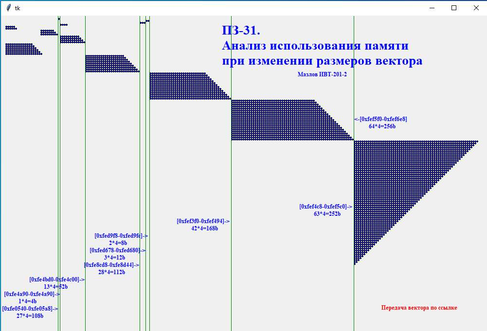
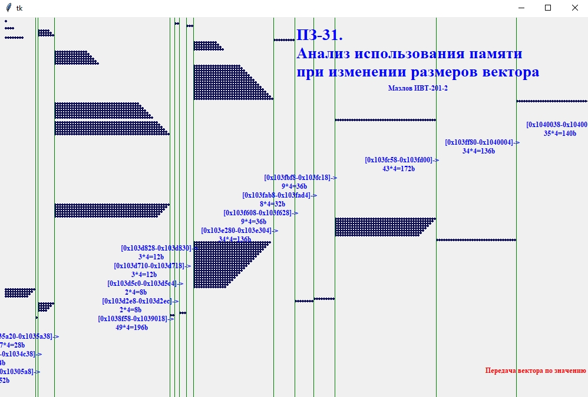

## Программирование
​Автор: Мазлов Иван
​ <h3> Первый семестр </h3>

МИНИСТЕРСТВО НАУКИ  И ВЫСШЕГО ОБРАЗОВАНИЯ РОССИЙСКОЙ ФЕДЕРАЦИИ 
Федеральное государственное автономное образовательное учреждение высшего образования 
"КРЫМСКИЙ ФЕДЕРАЛЬНЫЙ УНИВЕРСИТЕТ им. В. И. ВЕРНАДСКОГО" 
ФИЗИКО-ТЕХНИЧЕСКИЙ ИНСТИТУТ 
Кафедра компьютерной инженерии и моделирования

 
<h3 align="center">Отчёт по практическому занятию №31  по дисциплине "Программирование"</h3>
  

студента 1 курса группы ИВТ-б-о-201(2) 
Мазлова Ивана Денисовича 
направления подготовки 09.03.01 "Информатика и вычислительная техника"

  
<table>
<tr><td>Научный руководитель  старший преподаватель кафедры  компьютерной инженерии и моделирования</td>
<td>(&nbsp;&nbsp;&nbsp;&nbsp;&nbsp;&nbsp;&nbsp;&nbsp;&nbsp;&nbsp;&nbsp;&nbsp;&nbsp;&nbsp;&nbsp;&nbsp;&nbsp;&nbsp;&nbsp;&nbsp;&nbsp;&nbsp;&nbsp;&nbsp;&nbsp;&nbsp;&nbsp;&nbsp;&nbsp;&nbsp;&nbsp;&nbsp;)</td>
<td>Чабанов В.В.</td>
</tr>
</table>
  

 Симферополь, 2021

<h1>Текущий Контроль-4. Практическое занятие-31.  Адреса.<h1>

<h4>
Для более наглядного анализа выделения памяти под увеличивающийся и уменьшающийся вектор я написал небольшую программку 
на пайтоне, которая анализирует промежутки памяти при всех размерах вектора и отображает их в графическом виде при помощи
библиотеки Tkinter и виджета Canvas. Выводятся всё распределение памяти по адресам с указанием занимаемого размера.
Мне показалось, что так будет намного проще и аргументированней изучить данный процесс.
При этом мне пришлось немного изменить структуры выводимых данных, чтобы было проще простым копированием вставить её в
программу на пайтоне.
Вот что получилось при обработке адресов, занимаемых вектором при его увеличении и уменьшении при передаче вектора по ссылке:
 

Рис 1. Использование памяти при передаче по ссылке.

 

Память выделяется блоками. Подыскивается подходящий по размеру блок и он выделяется для размещения элементов вектора. 
Пока вектор имеет небольшой размер с++ удаётся располдить его в "мелких" сегментах памяти. Мы видим картину, когда вектора
длиной 5-6 и 14-19 используют один и тот же сегмент памяти, но при этом два соседних "переноса" никогда не используют
один и тот же участок памяти. Иначе невозможно было бы произвести копирование данных, не затирая предыдущие.
По мере возрастания вектора с++ должен обеспечить непрерывность элементов в памяти и вынужден искать всё большие 
непрерывные участки памяти.
Т.е. общий принцип такой: с++ подыскивает подходящий участок памяти, который, больше текущих размеров 
вектора на 50% и продолжает, постепенно добавляя элементы, двигаться к концу этого свободного участка. Как только участок заканчивается,
подыскивается другой подходящий по размеру свободный участок памяти и туда производится перенос всех элементов вектора. 
Таким образом обеспечивается неразрывность данных вектора.

Каждый раз, когда встаёт необходимость увеличить вектор, а памяти уже не хватает, то с++, новый блок 
памяти, который в полтора раза больше, чем текущий.
Методом исследования удалось доказать, что это так. И с++ именно подыскивает подходящий по размеру (но ОБЯЗАТЕЛЬНО непрерывный) 
кусок памяти, устанавливая capacity на +50% от текущего размера:
1 -> 2 -> 3 -> 4 -> 6 -> 9 -> 13 -> 19 -> 28 -> 42 -> 63 -> 94 и т.д. Как только capacity заканчивается, выделяется новый
кусок памяти, в которую влезет следующее capacity. Это можно увидеть на диаграммах.

Когда же мы начинаем постепенно уменьшать размер вектора, то он так и продолжает находиться в выделенном для него
куске памяти, никуда не смещая своего начала, вплоть до полного обнуления.

Вопрос 2.: 
Если запомнить адрес нулевой ячейки вектора при его длине 15 элементов, а затем внести изменения по запомненному адресу 
при длине вектора 25 элементов. Изменится ли значение нулевой ячейки вектора? Объяснить почему.

Ответ:
Нет не изменится. Т.к. в эти моменты вектор будет находиться в разных областях памяти из-за разной текущей capacity вектора (19 и 28). 
Но так делать очень опасно и не правильно, так как можно попасть в какие-то другие данные, не принадлежащие вектору.

Если же вектор идёт на убывание и его нулевой элемент постоянно находится в одном и том же месте, то, естественно, так
мы сможем поменять значение. Но так тоже лучше не делать.

Я не увидел сильной разницы при передаче вектора по ссылке и по значению. Думаю, что при уменьшении вектора переданного 
по значению не занятая им память сразу отдаётся и capacity вектора уменьшается. Важен принцип непрерывности
расположения элементов вектора и порядок вычисления убывающей capacity.

 

Рис 1. Использование памяти при передаче по значению.

 
</h4>
